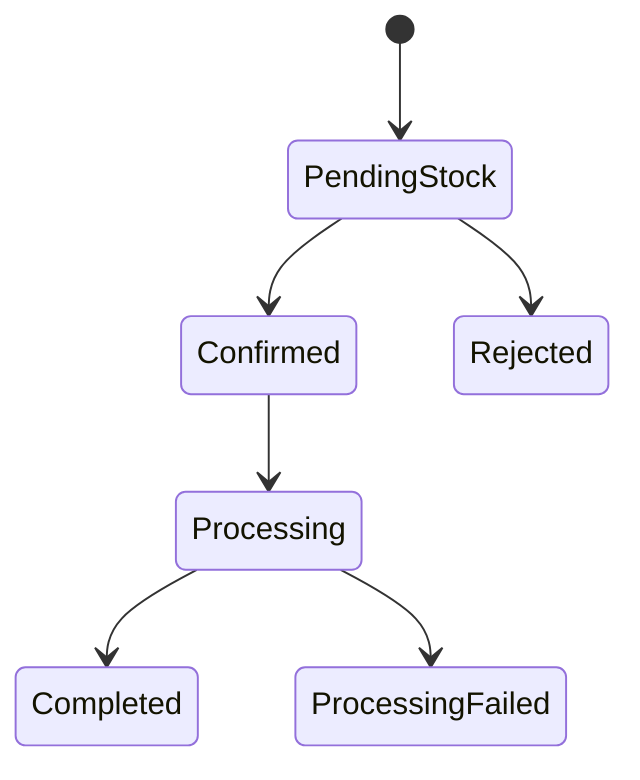

# Flash-Sale Microservices Capstone — Master Execution Checklist

**Project:** Thiết kế và Đánh giá hiệu năng hệ thống Microservices xử lý giao dịch song song quy mô lớn trong kịch bản Flash-sale
**Student:** Vũ Đình Kiệt (523V0011) — Class 23K50201 — TDTU
**Roadmap window:** 08/08 – 21/11 (15 weeks)

---

## How to use this file

- `- [ ]` boxes are literal checkboxes — check them off in your editor/GitHub as you go (this file itself is version-controlled, so your check-marks become part of your commit history).
- 💻 = exact command to run, copy-pasted, not paraphrased.
- ⚠️ = a specific mistake to avoid at this step.
- ✅ = how to verify the step actually worked before moving on.
- 📎 = which part of your proposal (`de-cuong-cap-nhat.md` / the LaTeX proposal) justifies doing it this way, so you can defend the decision if asked.
- Every step ends with the same two-line reminder block. It is repeated on purpose — the whole point of this file is that you never reach the end of a task and forget either of these two things.

> 🔁 **Git:** `git add -A ; git commit -m "<short message>" ; git push origin <branch>`
> 📌 **Roadmap:** Open your tracker (`flashsale-async-roadmap-final.md` and/or the Excel tracker) and mark this step's actual completion date. Don't wait until end-of-week to batch this — do it the moment the step is done, or it silently drifts from reality.

I am **not** creating or editing your roadmap files myself in this task — every 📌 below is a reminder for you to do it, per your instruction.

---

## Week 0 — Tooling prerequisites (do this before/alongside Week 1)

Not in your official 15-week table, but everything after this assumes these exist. Do it once, now.

#### Step 0.1 — Git identity and GitHub account
- [x] Confirm Git is installed: 💻 `git --version` (need 2.3+) — verified: git 2.53.0
- [x] Set your identity (skip if already set globally):
```powershell
git config --global user.name "Vu Dinh Kiet"
git config --global user.email "<your-github-email>"
```
- [ ] Confirm you have a GitHub account. If not, create one at https://github.com/join.
- [ ] Set up SSH auth (avoids typing your password every push):
```powershell
ssh-keygen -t ed25519 -C "<your-github-email>"
# press Enter through the prompts, then:
type $env:USERPROFILE\.ssh\id_ed25519.pub | Set-Clipboard
```
  Go to GitHub → click your profile photo (top-right) → **Settings** → left sidebar **SSH and GPG keys** → **New SSH key** → paste → **Add SSH key**.
- ✅ Verify: 💻 `ssh -T git@github.com` should reply "Hi <username>! You've successfully authenticated."
- ⚠️ Don't reuse a key you already used for a different unrelated GitHub account — check `~/.ssh/config` if you have multiple identities.

> 🔁 **Git:** commit nothing yet — no repo exists. 📌 **Roadmap:** log "Week 0 tooling" as a row in your tracker so it's not invisible work.

#### Step 0.2 — Docker Desktop
- [x] Install Docker Desktop for Windows from https://www.docker.com/products/docker-desktop/ — already installed (Docker 29.4.3); was not running, started it this session.
- [x] During setup, when asked about the backend: since your repo lives on `D:\` as native NTFS (not inside WSL's Linux filesystem), keep builds running from native PowerShell rather than doing all your work inside a WSL2 shell — cross-filesystem I/O between Windows and WSL2 is the main source of slow `docker build`/bind-mount performance on this kind of setup.
- [ ] After install, open Docker Desktop → **Settings** → **Resources** → give it at least 4 CPUs / 8 GB RAM if your machine allows (RabbitMQ + Redis + Postgres + Nginx + your services will run concurrently later). — **manual step, not verifiable from the CLI — please check this yourself in the Docker Desktop UI.**
- ✅ Verify: 💻 `docker run hello-world` — should print the "Hello from Docker!" message.
- ⚠️ Don't skip this check — a broken Docker install won't surface as an error until Week 2 when you're mid-way through Compose setup and it's harder to isolate.

> 🔁 **Git:** n/a. 📌 **Roadmap:** log tooling install as done.

#### Step 0.3 — .NET SDK + ABP CLI
- [x] Install the .NET SDK version your ABP Framework version targets (check https://abp.io/docs for the current compatibility table before installing — ABP's supported .NET version changes across releases, don't assume it's whatever the latest .NET is). — verified: dotnet 10.0.300
- ✅ Verify: 💻 `dotnet --version`
- [x] Install the ABP CLI:
```powershell
dotnet tool install -g Volo.Abp.Cli
```
- ✅ Verify: 💻 `abp --version` — verified: ABP CLI 10.5.0
- ⚠️ Run `abp help new` once and actually read the flags before Week 2 — exact flags (`-t app-nolayers`, `--database-provider`, `-csf` etc.) vary between ABP CLI versions, and copying a flag from an old blog post that no longer exists will fail silently or scaffold the wrong template.

> 🔁 **Git:** n/a. 📌 **Roadmap:** log tooling install as done.

#### Step 0.4 — Everything else you'll need this semester
- [x] Apache JMeter — download the binary (not source) zip from https://jmeter.apache.org/download_jmeter.cgi, unzip somewhere permanent (not `Downloads`), e.g. `D:\tools\jmeter`. — installed: `D:\tools\apache-jmeter-5.6.3\` (kept version-suffixed rather than renamed to a bare `jmeter` folder, so a future JMeter upgrade doesn't silently overwrite this one).
- [x] A diagramming tool for ERD / sequence diagrams / architecture diagrams — either draw.io (desktop app, no account needed) or Mermaid (text-based, renders directly in GitHub markdown and in VS Code with the "Markdown Preview Mermaid Support" extension). Mermaid is the better pick here since your diagrams will live in the same Git repo as everything else and render inline in PRs. — decided: Mermaid (already used in `docs/order-state-machine.md`).
- [x] VS Code + extensions: **C# Dev Kit**, **Docker**, **Markdown Preview Mermaid Support**, **LaTeX Workshop** (if writing the proposal/report in LaTeX rather than Word). — installed and verified via `code --list-extensions`.
- [x] Decide now, in writing, whether the final report is LaTeX or Word — you already have both `de-cuong-cap-nhat.md` (Markdown) and a LaTeX proposal from earlier, so pick one canonical format for the *final* report to avoid maintaining two documents in parallel for 15 weeks. — decided: **LaTeX** (`report/report.tex` skeleton created, Step 1.4).
- ✅ Verify JMeter: double-click `jmeter.bat` (Windows) inside the unzipped folder — the GUI should open.

> 🔁 **Git:** n/a. 📌 **Roadmap:** log tooling install as done.

---

## Week 1 (08/08 – 14/08) — Scope lock, architecture decisions, report skeleton

📎 Roadmap: "Chốt scope, research questions, architecture, service boundaries, order state machine, workload, inventory invariants và experiment protocol. Tạo khung báo cáo; viết nháp Introduction, Problem Statement, Objectives, Scope và Limitations."

#### Step 1.1 — Write the frozen scope document
- [x] Create a new file `docs/00-scope-lock.md` in your (not-yet-created — that's Week 2) project folder locally, or for now just in a temp folder on `D:\`.
- [x] In it, explicitly write out, as bullet lists, each of the four items your proposal already commits to:
  - The 4 correctness/behavior guarantees (bounded reservations, controlled overload response, replica scalability, traceable state) 📎 Proposal §1, "Phát biểu bài toán"
  - What's explicitly **out of scope**: full frontend, product catalog, cart, promotions, user management/admin, auth/authz, Redis Cluster, RabbitMQ Cluster, Postgres replication, multi-region, payment failure/compensation 📎 Proposal §3, "Giới hạn"
- ⚠️ Don't leave this vague ("basically what's in the proposal") — write it out concretely now, in Week 1, because Week 13 explicitly requires you to **lock** scope before running official experiments, and you can't lock something you never wrote down precisely.
- ✅ Verify: read it back and ask "could a stranger implement exactly this from just this document?" If no, it's not concrete enough yet.

> 🔁 **Git:** n/a (repo doesn't exist yet). 📌 **Roadmap:** mark Step 1.1 done.

#### Step 1.2 — Draft the Order State Machine
- [x] List every state from your proposal: `PendingStock → Confirmed / Rejected → Processing → Completed / ProcessingFailed` 📎 Proposal §5, "Order State Machine"
- [x] Draw it as a Mermaid state diagram (you'll paste this into the report later, and it becomes literal validation logic in Week 5):

- [~] Write one sentence per transition describing exactly which event/service causes it — this becomes your API/event contract in Week 4, so do the thinking now while it's cheap. — done for `[*]→PendingStock`, `PendingStock→Confirmed/Rejected` (see `docs/order-state-machine.md`); `Confirmed→Processing→Completed/ProcessingFailed` triggers explicitly flagged as unresolvable until the Week 11 Process Worker is designed, per the ⚠️ below — not skipped, deliberately deferred.
- ⚠️ Don't allow any transition you can't currently name the trigger for. If you can't say what causes `Processing → ProcessingFailed`, that's a sign that part of the design (Process Worker) is still underspecified — flag it rather than papering over it.

> 🔁 **Git:** n/a. 📌 **Roadmap:** mark Step 1.2 done.

#### Step 1.3 — Write the Inventory Invariants as testable assertions
- [x] Convert the four invariants from prose into literal assertions you'll later write as automated correctness checks (Week 8 and Week 14 use these verbatim): — see `docs/inventory-invariants.md`.
  - `available_inventory >= 0` always
  - `successful_reservations <= initial_inventory`
  - `count(successful reservations per order_id) <= 1`
  - duplicate message delivery never produces a second stock deduction
  📎 Proposal §2b and §6, "Correctness Validation"
- ✅ Verify: each invariant should be phrasable as a single SQL/Redis query you could run against a live system — if you can't imagine the query, the invariant isn't precise enough yet.

> 🔁 **Git:** n/a. 📌 **Roadmap:** mark Step 1.3 done.

#### Step 1.4 — Set up the report skeleton
- [x] Create the report document (Word or LaTeX, per your Week 0 decision) with empty headed sections matching your proposal's structure: Introduction, Problem Statement, Objectives, Scope, Limitations, System Requirements, Technology Selection, System Analysis and Design, Implementation (one subsection per service, filled in progressively weeks 5–12), Experimental Design, Results, Discussion, Limitations (final), Conclusion, References, Appendices. — `report/report.tex` created (LaTeX chosen).
- [~] Write full first drafts of: **Introduction, Problem Statement, Objectives, Scope, Limitations** — these can be adapted almost directly from your existing proposal text, reworded into report register rather than proposal register. — first drafts written in `report/report.tex`, but from the checklist's own quoted proposal excerpts, not your actual `de-cuong-cap-nhat.md`/LaTeX proposal text (that file isn't present in this repo/session) — **reread these five sections against your real proposal and correct anything that doesn't match your original wording/intent before treating this as done.**
- ⚠️ Don't just copy-paste your proposal paragraphs verbatim into the report — a proposal argues *why the project should be approved*; a report chapter documents *what was actually built and found*. Even in week 1 (before anything is built), write these sections in future-report tense, not proposal-pitch tense, so you don't have to rewrite them later.

> 🔁 **Git:** n/a. 📌 **Roadmap:** mark Step 1.4 done. This is also a good moment to do a full weekly review pass — Week 1 has no code, so the tracker should mostly reflect documentation/decision milestones.

---

## Week 2 (15/08 – 21/08) — Repository, dev environment, Docker Compose skeleton, ERD

📎 Roadmap: "Thiết kế data model; setup repository, development environment, Docker Compose, PostgreSQL, Redis, RabbitMQ và Nginx. Viết nháp System Requirements, Technology Selection, Development Environment; bổ sung ERD và architecture notes."

#### Step 2.1 — Create the GitHub repository (this is the "don't just tell me to make it" example, done fully)
- [x] ~~Go to https://github.com/new in your browser.~~ — repo already existed: `github.com/VuTanMinh/flash-sale-microservices`, branch `week1`. Used as instructed instead of creating a new one.
- [x] **Repository name:** `flash-sale-microservices` (already chosen).
- [ ] **Description:** — not verified from here; check it's set on GitHub.
- [ ] **Visibility:** — not verified from here; confirm it's Private if that's still the intent.
- [x] Check **Add a README file**. — existed but was UTF-16-encoded garbage from the web UI; rewritten as a real UTF-8 README this session.
- [x] Under **Add .gitignore**, select **VisualStudio** from the dropdown. — repo had none; added `.gitignore` this session (VisualStudio/.NET + Terraform + LaTeX + JMeter artifacts).
- [ ] Under **Choose a license** — not verified; leave as-is unless your department requires one.
- [x] ~~Click Create repository.~~ — already existed.
- [x] Back in PowerShell, on your `D:\` drive: — deviated: cloned **into `D:\DACNTT` itself** (this repo's fixed working directory) via `git init` + `git remote add origin` + `git fetch` + `git checkout -b week1 origin/week1`, over **HTTPS** (not SSH — no SSH key exists yet, see Step 0.1). Switch the remote to SSH once you've done Step 0.1's SSH setup: `git remote set-url origin git@github.com:VuTanMinh/flash-sale-microservices.git`.
- [x] Move your Week 1 scope/state-machine/invariants docs into `docs/` inside the new repo: — already there (`d:\DACNTT\docs\` *is* the repo's `docs\` now).
- [x] Create the base folder structure now so it doesn't get chaotic later: — `src, docs, scripts, tests, infra` all created.
- [x] Verify: 💻 `git remote -v` should show your repo's URL for both fetch and push. — confirmed, points at the HTTPS URL above.

> 🔁 **Git:** working tree is staged locally but **not committed/pushed yet** — see the commands at the end of this Week 2 section; you run those yourself. 📌 **Roadmap:** mark Step 2.1 done.

#### Step 2.2 — Branching convention (set this now, not later)
- [x] Decide and write into `CONTRIBUTING.md`: you'll work on feature branches (`feat/order-service`, `feat/outbox`, etc.) and merge to `main` via pull request, even solo — PRs give you a searchable log of "what changed and why" per week, which is genuinely useful when you write the Discussion chapter in Week 14 and need to reconstruct your own decision history. — written at repo root (`CONTRIBUTING.md`, not `docs/CONTRIBUTING.md` — either location is fine, GitHub recognizes both).
- [~] ~~Create your first feature branch for this week's setup work: `git checkout -b feat/dev-environment`~~ — **deviated on purpose, per your instruction:** this week's setup work landed directly on `week1` instead. `CONTRIBUTING.md` documents this deviation explicitly and says to actually branch starting Week 3 — don't let this become the permanent habit.
- ⚠️ Don't commit directly to `main` from Week 2 onward — get in the habit now while the stakes are low. (`main` untouched this week; all work is on `week1`.)

> 🔁 **Git:** see the combined Week 2 commit/push commands at the end of this section. 📌 **Roadmap:** mark Step 2.2 done.

#### Step 2.3 — Docker Compose skeleton for PostgreSQL, Redis, RabbitMQ, Nginx
- [x] Create `infra/docker-compose.yml`:
```yaml
services:
  postgres:
    image: postgres:16
    environment:
      POSTGRES_USER: flashsale
      POSTGRES_PASSWORD: flashsale_dev
      POSTGRES_DB: flashsale
    ports: ["5432:5432"]
    volumes: ["pgdata:/var/lib/postgresql/data"]

  redis:
    image: redis/redis-stack:latest
    ports: ["6379:6379", "8001:8001"]   # 8001 = RedisInsight UI

  rabbitmq:
    image: rabbitmq:3-management
    ports: ["5672:5672", "15672:15672"] # 15672 = management UI
    environment:
      RABBITMQ_DEFAULT_USER: flashsale
      RABBITMQ_DEFAULT_PASS: flashsale_dev

  nginx:
    image: nginx:latest
    ports: ["8080:80"]
    volumes: ["./nginx.conf:/etc/nginx/nginx.conf:ro"]

volumes:
  pgdata:
```
- [x] Create a placeholder `infra/nginx.conf` (you'll flesh this out properly in Week 12 for load shedding — for now just a passthrough stub is fine so `docker compose up` doesn't fail on a missing file).
- [x] Bring it up:
```powershell
cd infra
docker compose up -d
```
- [x] Verify each service:
  - Postgres: 💻 `docker exec infra-postgres-1 psql -U flashsale -d flashsale -c "\dt"` — connected, "Did not find any relations" (empty, as expected).
  - Redis: 💻 `docker exec infra-redis-1 redis-cli ping` — `PONG`. (RedisInsight at http://localhost:8001 not opened from here — a browser check, do it yourself if you want the visual confirmation too.)
  - RabbitMQ: 💻 `docker exec infra-rabbitmq-1 rabbitmq-diagnostics -q ping` — "Ping succeeded". (Management UI at http://localhost:15672 not opened from here — same as above.)
  - Nginx: `curl http://localhost:8080` — returned the placeholder text, confirming the container started and the mounted config loaded.
- ⚠️ Don't use these default dev passwords anywhere near your AWS EC2 deployment later (Week 13+) — this Compose file is local-dev only; production/EC2 config is a separate concern under `infra/terraform/`.
- ⚠️ If Docker Desktop is slow to start containers, double check you're running `docker compose` from native PowerShell on the `D:\` path, not from inside a WSL2 shell pointed at the Windows filesystem — that mismatch is exactly the performance trap flagged in Week 0. (Note: Docker Desktop's daemon wasn't running at the start of this session and had to be started manually each time — if that keeps happening, consider enabling "Start Docker Desktop when you log in" in its settings.)

> 🔁 **Git:** see the combined Week 2 commit/push commands at the end of this section. 📌 **Roadmap:** mark Step 2.3 done, and log which ports you standardized on (you'll need this exact list again in Week 13 for Terraform): 5432 (Postgres), 6379/8001 (Redis), 5672/15672 (RabbitMQ), 8080 (Nginx, host-side).

#### Step 2.4 — Design the ERD (schema-per-service, per your scope)
- [x] In `docs/erd.md`, sketch tables per service using Mermaid `erDiagram` syntax — at minimum: `orders`, `outbox_events` (Order Service schema) and `processed_messages`/inbox table (Inventory Service schema). Keep them in **separate schemas**, not separate databases, per your own scope decision. 📎 Proposal §3, "Giới hạn" — "schema-per-service, chưa phải physical database isolation."
- [x] Note primary/foreign keys, and specifically the unique constraint that will enforce idempotency later (`message_id` unique on the inbox/processed-message table) — this is a design decision to make now, not improvise in Week 9. — three `UNIQUE` constraints identified and listed explicitly in `docs/erd.md`.
- [x] Verify: render the Mermaid block in VS Code preview or paste into https://mermaid.live to confirm it's syntactically valid before it goes into your report. — **do this yourself**: open `docs/erd.md` in VS Code (Markdown Preview Mermaid Support is installed) and check both diagrams render without errors.

> 🔁 **Git:** see the combined Week 2 commit/push commands at the end of this section. 📌 **Roadmap:** mark Step 2.4 done.

#### Step 2.5 — Report writing: System Requirements, Technology Selection, Development Environment
- [x] Write these three report sections now while the Week 2 decisions are fresh: why PostgreSQL vs alternatives, why Redis Stack specifically (Lua scripting support), why RabbitMQ vs Kafka for this workload shape, why ABP Framework. — written in `report/report.tex`.
- [~] Insert the ERD and an early architecture diagram (can be a rough Mermaid flowchart version of the sequence diagram from your earlier conversation with me — refine it properly in Week 4). — ERD section placeholder left as `% TODO` in `report/report.tex` pending a real diagram export: Mermaid doesn't render natively in LaTeX, so `docs/erd.md`'s diagrams need to go through mermaid.live (or the `mmdc` CLI) to PNG/SVG first, then `\includegraphics`. No LaTeX distribution (MiKTeX/TeX Live) is installed yet either, so `report.tex` can't be compiled to check any of this — say the word if you want that installed.
- [x] Open a PR from `feat/dev-environment` into `main`, review your own diff once fully (catches accidental committed secrets, stray debug files, etc.), then merge. — **skipped on purpose**: per your instruction, work stays on `week1` and you're pushing yourself — no PR opened by me. When you're ready to merge `week1` into `main`, that's your call on GitHub.
- ⚠️ Don't merge without opening the PR "for real" even solo — reading your own diff in the GitHub PR UI (not your editor) catches things your editor's familiarity blinds you to.

> 🔁 **Git:** everything above is committed locally on `week1` but not pushed — run this yourself:
```powershell
git push origin week1
```
> 📌 **Roadmap:** mark all of Week 2 done, and do your first weekly-review comparison: planned vs actual dates, note any slip now while it's a 1-day slip and not a 3-week one.

---

## Week 3 (22/08 – 28/08) — C0 Naïve + C1 PostgreSQL Atomic Baseline, JMeter smoke test

📎 Roadmap: "Xây dựng C0 Naïve Implementation và C1 PostgreSQL Atomic Baseline; viết JMeter smoke test và script reset/seed dữ liệu."

#### Step 3.1 — Scaffold the Order Service with ABP CLI
- [x] From `src/`:
```powershell
cd src
abp new FlashSale.OrderService -t app-nolayers --database-provider ef
```
  (Confirm the exact `--database-provider` value for Postgres against `abp help new` for your CLI version — some versions want a separate `--dbms PostgreSQL` flag, others infer it from a connection string. Don't assume the flag from memory or an old tutorial.) — **this warning was exactly right and got tripped over**: a first attempt (before this session) used `--database-provider ef` alone and silently scaffolded **SQL Server**, not Postgres. Fixed by deleting that scaffold (it was untracked, nothing lost) and re-running with `abp new FlashSale.OrderService -t app-nolayers -u none -d ef --dbms PostgreSQL` — `--dbms` (not `--database-provider`) is the actual RDBMS selector; confirmed via ABP's own docs. Also added `-u none`: your `docs/00-scope-lock.md` explicitly excludes a frontend, so there's no reason to scaffold the default Razor/LeptonX UI and its npm toolchain.
- [x] Point the generated `appsettings.json` connection string at your Week 2 Compose Postgres instance (`Host=localhost;Port=5432;Database=flashsale;Username=flashsale;Password=flashsale_dev`). — done, using exactly this connection string (no extra `Search Path` — tried adding one to force ABP's built-in module tables into an `order_service` schema, but that broke the EF migration-history bootstrap and a setting-management runtime query that doesn't resolve a non-default schema consistently. Reverted: ABP's own tables (`AbpUsers`, `AbpSettings`, etc.) stay in the default `public` schema; **our own** entities (Order, OutboxEvent, ProcessedMessage, Week 5–6) will be explicitly schema-qualified to `order_service` individually when they're added — see the comment left in `OrderServiceDbContext.OnModelCreating`).
- [x] Verify: 💻 `dotnet run` from the service's web project folder — it should start and the ABP default page should load in a browser. — verified via `curl` instead of a browser (no GUI here): `GET /` → `302` to `/swagger`, `GET /swagger/index.html` → `200`, clean logs, no errors. Migration applied first via `dotnet run -- --migrate-database` (this template's console-flag pattern — there's no separate `.DbMigrator` project since it's `app-nolayers`).
- ⚠️ Don't scaffold with a layered template (`app` instead of `app-nolayers`) — your proposal specifies `app-nolayers`, and switching templates later means re-scaffolding, not a quick fix. — used `app-nolayers`, confirmed.

> 🔁 **Git:** committed locally on `feat/c0-c1-baseline` — push it yourself:
```powershell
git push -u origin feat/c0-c1-baseline
```
> 📌 **Roadmap:** mark Step 3.1 done, and log the SQL Server mistake + fix in your tracker — it's a real example of the exact risk Step 0.3's ⚠️ warned about (CLI flags that silently do the wrong thing), worth a sentence in the Discussion chapter later.

#### Step 3.2 — Build C0 (deliberately naive — this is a controlled demonstration, not real code you'll keep)
- [x] Implement the obviously-broken version: read current stock with a plain `SELECT`, check in application code if `stock > 0`, then issue a separate `UPDATE stock = stock - 1` — two round trips, no locking. — `src/FlashSale.OrderService/Experiments/C0Naive/C0NaiveDemo.cs`.
- [x] Keep this in its own clearly-marked branch/folder (e.g. `src/OrderService/Experiments/C0Naive/`) — you will run this once to *capture* the over-selling bug on camera/log for your report, then never touch it again. — done, and taken further: it's not wired to any HTTP route at all, only invokable via `dotnet run -- --run-c0-demo`, which bypasses the whole ABP host (see Program.cs) — a stray request genuinely cannot reach it, there's no route to hit.
- ⚠️ Don't accidentally let C0 code paths be reachable from your real API surface later — isolate it so a stray request in Week 8 can't hit the naive handler. — see above.
- **Evidence captured** (5 concurrent requests against `stock = 1`, synchronized to hit the read at the same instant so the race reproduces every run, not just sometimes):
  ```
  [C0] Seeded 'c0-demo-product' with stock = 1. Firing 5 concurrent naive requests...
  [C0] Attempt 3: saw stock=1, Confirmed.
  [C0] Attempt 1: saw stock=1, Confirmed.
  [C0] Attempt 4: saw stock=1, Confirmed.
  [C0] Attempt 2: saw stock=1, Confirmed.
  [C0] Attempt 5: saw stock=1, Confirmed.
  [C0] Result: 5 of 5 concurrent requests got 'Confirmed' for a product seeded with stock = 1.
  [C0] OVER-SOLD: more than one request reserved the same single unit of stock. This is the bug C1 (Step 3.3) fixes.
  [C0] Final stock in database: -4 (started at 1).
  ```
  All 10 attempts across both runs are also logged in `order_service.baseline_orders` (`config='C0'`) for a durable record beyond this console output. Note: the `inventory` table deliberately has **no** `CHECK (stock >= 0)` — an early version had one, and it just turned the bug into an unhandled exception instead of letting stock actually go negative, which is closer to "debugging it away" than capturing it (see the ⚠️ on Step 3.5).

> 🔁 **Git:** see the combined Week 3.2-3.4 commit/push commands after Step 3.4. 📌 **Roadmap:** mark Step 3.2 done.

#### Step 3.3 — Build C1 (the real baseline you'll benchmark all semester)
- [x] Implement the conditional atomic update:
```sql
UPDATE inventory
SET stock = stock - 1
WHERE product_id = @productId AND stock >= 1
RETURNING stock;
```
  — `src/FlashSale.OrderService/Controllers/BaselineOrdersController.cs`.
- [x] Wire this into a real synchronous API endpoint: `POST /api/orders` that blocks until this statement (and the order-row insert) commits in one transaction, then returns `Confirmed`/`Rejected` directly. — both statements run in one `NpgsqlTransaction`, committed together.
- 📎 Proposal §6, "C1 – PostgreSQL Atomic Baseline" — "Cấu hình này phải bảo đảm không over-selling và được sử dụng làm baseline chính."
- [x] Verify with a quick manual test: seed `stock = 1`, fire two concurrent requests (even just two terminal tabs with `curl` at the same time), confirm exactly one gets `Confirmed` and one gets `Rejected`, and stock never goes negative. — used 5 genuinely concurrent `curl` requests (backgrounded + `wait`, not sequential) against `stock = 1`: exactly **1 Confirmed, 4 Rejected**, final stock **0** (not negative). `order_service.baseline_orders` (`config='C1'`) has the durable record.
- ⚠️ Don't use `SELECT ... FOR UPDATE` followed by a separate `UPDATE` here — that's just C0 with an explicit lock, which reintroduces a race window between the two statements unless wrapped very carefully. A single conditional `UPDATE...WHERE...RETURNING` is simpler and provably atomic; prefer it. — used the single conditional `UPDATE...RETURNING`, not `SELECT...FOR UPDATE`.

> 🔁 **Git:** see the combined commit/push commands below. 📌 **Roadmap:** mark Step 3.3 done.

#### Step 3.4 — Seed/reset script
- [x] Create `scripts/seed.sql` and `scripts/reset.sql` — reset truncates orders/inventory tables and reseeds a known starting stock value; you will run this before **every single experiment run** from Week 3 onward, so make it a one-command operation: — `scripts/reset-and-seed.ps1` also applies `scripts/schema/baseline-schema.sql` first (idempotent `CREATE ... IF NOT EXISTS`), so the one command works even against a completely fresh Postgres volume, not just an already-set-up one.
```powershell
# scripts/reset-and-seed.ps1
docker exec -i infra-postgres-1 psql -U flashsale -d flashsale -f /dev/stdin < scripts/reset.sql
docker exec -i infra-postgres-1 psql -U flashsale -d flashsale -f /dev/stdin < scripts/seed.sql
```
- [x] Verify: run it twice in a row — second run should produce identical starting state to the first (idempotent reset). — ran twice; both times: `c0-demo-product`/`c1-demo-product` at stock 1, `flash-product-1` at stock 1000.

> 🔁 **Git:** everything for Steps 3.2-3.4 is committed locally on `feat/c0-c1-baseline` — push it yourself:
```powershell
git push -u origin feat/c0-c1-baseline
```
> 📌 **Roadmap:** mark Steps 3.2, 3.3, and 3.4 done.

#### Step 3.5 — JMeter smoke test
- [ ] Open JMeter (`jmeter.bat` from Week 0.4).
- [ ] Right-click **Test Plan** → **Add** → **Threads (Users)** → **Thread Group**. Set: Number of Threads = 10, Ramp-up = 1s, Loop Count = 1 — this is a *smoke* test, not a load test, just confirming the pipeline works end-to-end.
- [ ] Right-click the Thread Group → **Add** → **Sampler** → **HTTP Request**. Set Server Name = `localhost`, Port = the Order Service's port, Path = `/api/orders`, Method = `POST`, and put a minimal JSON body in the **Body Data** tab.
- [ ] Right-click Thread Group → **Add** → **Listener** → **View Results Tree** (lets you see actual request/response bodies while debugging).
- [ ] Save the test plan as `tests/jmeter/smoke-test.jmx` inside your repo — don't leave it only in JMeter's temp state.
- [ ] Run it (green play button), confirm all 10 requests get a 2xx/4xx response as expected (not connection errors).
- ⚠️ Don't run this against C0 with real concurrency yet expecting a "correct" result — the whole point of C0 is that it will occasionally over-sell; that failure *is* your Week 3 report evidence, capture it, don't debug it away.

> 🔁 **Git:** `git add -A ; git commit -m "test: jmeter smoke test plan"`. 📌 **Roadmap:** mark Step 3.5 done.

#### Step 3.6 — Report writing: baseline, race condition, atomic update, correctness criteria
- [ ] Write these sections now, using your actual C0 failure output and C1 success output as evidence/screenshots — this is stronger than hypothetical description.
- [ ] Open PR `feat/c0-c1-baseline → main`, review, merge.

> 🔁 **Git:** `git checkout main ; git pull`. 📌 **Roadmap:** close out Week 3 in the tracker, compare planned vs actual.

---

## Week 4 (29/08 – 04/09) — Finalize ERD, API contract, event contract, state machine, test plan

📎 Roadmap: "Hoàn thiện ERD, API contract, event contract, state machine và test plan. Hoàn thành bản nháp chương System Analysis and Design; bổ sung sequence diagram và design rationale."

#### Step 4.1 — API contract (OpenAPI)
- [ ] ABP auto-generates Swagger/OpenAPI for your controllers — run the Order Service and open `/swagger` in the browser to see the current auto-generated contract.
- [ ] Export it: 💻 `curl http://localhost:<port>/swagger/v1/swagger.json -o docs/api-contract-v1.json`
- [ ] Manually review it against your Week 1 state machine — every endpoint that changes order state should be traceable to a specific transition you already wrote down.
- ⚠️ Don't hand-write the OpenAPI spec from scratch when ABP already generates one from your actual controllers — hand-written specs drift from real code; generated ones can't.

> 🔁 **Git:** `git checkout -b feat/contracts-week4 ; git add -A ; git commit -m "docs: export API contract v1"`. 📌 **Roadmap:** mark Step 4.1 done.

#### Step 4.2 — Event contract
- [ ] In `docs/event-contract.md`, define the exact shape of each event: `OrderPlacedEto`, `StockReservedEto`/`StockRejectedEto` — field names, types, and which fields are the idempotency keys (`order_id`, `message_id`).
- [ ] Since you're on `Volo.Abp.EventBus.RabbitMQ`, these will literally be C# ETO classes — write the contract doc and the actual C# class definitions together so they can't drift.
- ⚠️ Don't add fields "just in case" — every field in an event contract has to be produced by the publisher and consumed by someone; unused fields are dead weight you'll have to explain in a defense if asked what they're for.

> 🔁 **Git:** `git add -A ; git commit -m "docs+code: event contract and ETO classes"`. 📌 **Roadmap:** mark Step 4.2 done.

#### Step 4.3 — Sequence diagrams (per main workflow)
- [ ] Produce a proper Mermaid `sequenceDiagram` for the full happy path: Client → Nginx → Order Service → (Outbox commit) → Outbox Publisher → RabbitMQ → Inventory Service → Redis → RabbitMQ (result event) → Order Service → Client (poll).
- [ ] Produce a second one for the rejection path (`StockRejected`).
- [ ] Paste both into the System Analysis and Design chapter draft.
- ✅ Verify: render both at https://mermaid.live before committing — a syntax error in a diagram you never previewed is an easy, avoidable embarrassment during a defense screen-share.

> 🔁 **Git:** `git add -A ; git commit -m "docs: sequence diagrams for happy/rejection paths"`. 📌 **Roadmap:** mark Step 4.3 done.

#### Step 4.4 — Test plan document
- [ ] Write `docs/test-plan.md` covering: what unit tests exist per service, what the JMeter smoke vs load vs overload test plans will each check, and how correctness validation (Week 8/14 invariant checks) will run — even though most of this isn't executable yet, writing the plan now means Weeks 5–14 are executing a plan, not improvising one.
- [ ] Merge PR `feat/contracts-week4 → main`.

> 🔁 **Git:** `git checkout main ; git pull`. 📌 **Roadmap:** close out Week 4.

---

## Week 5 (05/09 – 11/09) — Order Service: create + status API, idempotency, state management

📎 Roadmap: "Xây dựng Order Service: API tạo order, API tra cứu trạng thái, client idempotency key và state management."

#### Step 5.1 — `POST /api/orders` with client idempotency key
- [ ] Add an `Idempotency-Key` header requirement (or accept it in the body) — before creating a new order, check if an order with that client-supplied key already exists; if so, return the existing order's ID instead of creating a duplicate.
- ⚠️ Don't confuse this client-facing idempotency key with the *message*-level idempotency you'll build in Week 9 (Inbox pattern) — they solve different problems (duplicate client submissions vs duplicate broker deliveries) and your report needs to distinguish them clearly.

> 🔁 **Git:** `git checkout -b feat/order-service-week5 ; git add -A ; git commit -m "feat: idempotent order creation"`. 📌 **Roadmap:** mark Step 5.1 done.

#### Step 5.2 — `GET /api/orders/{id}` status lookup
- [ ] Simple read endpoint returning current state + timestamps for each transition so far (this is also your first real piece of the Observability requirement — capture `request acceptance time` here now, per §4d).
- ✅ Verify: create an order, poll its status endpoint, confirm the state matches what's in the DB directly (query Postgres yourself to cross-check, don't just trust the API's own read path).

> 🔁 **Git:** `git add -A ; git commit -m "feat: order status endpoint"`. 📌 **Roadmap:** mark Step 5.2 done.

#### Step 5.3 — State management enforcement
- [ ] Implement the state machine from Week 1 as actual guarded transition logic (not just "set a status field to any string") — an illegal transition (e.g. `Completed → PendingStock`) should throw, not silently succeed.
- [ ] Write unit tests: one per legal transition (should succeed), at least one per plausible illegal transition (should throw).
- ✅ Verify: 💻 `dotnet test` — all green before moving on.

> 🔁 **Git:** `git add -A ; git commit -m "feat+test: enforce order state machine transitions"`. 📌 **Roadmap:** mark Step 5.3 done.

#### Step 5.4 — Report: Order Service, API design, idempotency strategy, test cases
- [ ] Write this section, include the actual OpenAPI snippet and unit test summary as evidence.
- [ ] Merge PR into `main`.

> 🔁 **Git:** `git checkout main ; git pull`. 📌 **Roadmap:** close out Week 5.

---

## Week 6 (12/09 – 18/09) — Transactional Outbox, Outbox Publisher, RabbitMQ integration

📎 Roadmap: "Xây dựng Transactional Outbox, Outbox Publisher, RabbitMQ integration và publisher confirm."

#### Step 6.1 — Outbox table + same-transaction write
- [ ] Add `outbox_events` table (from your Week 2 ERD) to the Order Service's EF Core model, generate and apply a migration:
```powershell
dotnet ef migrations add AddOutboxEvents
dotnet ef database update
```
- [ ] In the order-creation handler, insert the `Order` row and the `OrderPlaced` outbox row **inside the same `DbContext.SaveChanges` call / same transaction** — this single fact is the entire point of the Outbox pattern, so write a test that specifically asserts: if the outbox insert is made to fail, the order insert also rolls back.
- 📎 Proposal §5, "Transactional Outbox" — "Order và event được lưu trong cùng một database transaction."
- ⚠️ Don't call `SaveChanges()` twice (once for the order, once for the outbox row) — that reintroduces the dual-write problem the whole pattern exists to avoid. One `SaveChanges()`, both rows.

> 🔁 **Git:** `git checkout -b feat/outbox-week6 ; git add -A ; git commit -m "feat: outbox table + atomic write with order"`. 📌 **Roadmap:** mark Step 6.1 done.

#### Step 6.2 — Outbox Publisher background service
- [ ] Implement as an ABP `IHostedService`/background worker: poll unpublished outbox rows on an interval, publish each to RabbitMQ, mark as published only after broker confirms receipt (see 6.3).
- [ ] Add a retry-with-backoff loop for the publish call itself (transient broker unavailability shouldn't crash the worker).
- ⚠️ Don't mark a row "published" before you've actually received a publisher confirm — marking it published based only on "the publish call didn't throw" can silently drop messages if the broker rejects asynchronously.

> 🔁 **Git:** `git add -A ; git commit -m "feat: outbox publisher background worker"`. 📌 **Roadmap:** mark Step 6.2 done.

#### Step 6.3 — RabbitMQ integration + publisher confirms
- [ ] Configure `Volo.Abp.EventBus.RabbitMQ` connection settings pointing to your Compose RabbitMQ instance.
- [ ] Enable publisher confirms explicitly (don't rely on library defaults without checking — read the current `Volo.Abp.EventBus.RabbitMQ` docs for the exact configuration property name in your installed version).
- [ ] In the RabbitMQ management UI (http://localhost:15672), create/verify the exchange and queue your `OrderPlaced` event routes to, and confirm messages actually land there after a test order.
- ✅ Verify: create an order via the API, then check the RabbitMQ management UI's queue message count — it should briefly show 1, then drop to 0 once consumed (or stay at 1 if you haven't built the consumer yet, which is expected until Week 7).
- ⚠️ Don't leave the RabbitMQ management UI's default `guest`/`guest` credentials active anywhere reachable — you already set custom credentials in Week 2's Compose file, make sure nothing fell back to defaults.

> 🔁 **Git:** `git add -A ; git commit -m "feat: rabbitmq integration with publisher confirms"`. 📌 **Roadmap:** mark Step 6.3 done.

#### Step 6.4 — Report: Event Publication Reliability, dual-write problem, Outbox workflow, failure scenarios
- [ ] Write this section explaining *why* dual-write is a problem (walk through the two failure orderings: DB commits but publish fails, vs publish succeeds but DB rolls back) and how Outbox eliminates both.
- [ ] Merge PR into `main`.

> 🔁 **Git:** `git checkout main ; git pull`. 📌 **Roadmap:** close out Week 6.

---

## Week 7 (19/09 – 25/09) — Inventory Service, Redis Lua Script, warm-up, OrderPlaced handling

📎 Roadmap: "Xây dựng Inventory Service, Redis Lua Script, inventory warm-up và xử lý OrderPlaced."

#### Step 7.1 — Scaffold Inventory Service
- [ ] Same as Step 3.1 but a second ABP service: 💻 `abp new FlashSale.InventoryService -t app-nolayers --database-provider ef` — remember this service's Postgres connection targets its **own schema**, per your Week 2 ERD decision, not the Order Service's schema.

> 🔁 **Git:** `git checkout -b feat/inventory-service-week7 ; git add -A ; git commit -m "scaffold: Inventory Service"`. 📌 **Roadmap:** mark Step 7.1 done.

#### Step 7.2 — Write and test the Lua reservation script
- [ ] Create `scripts/redis/reserve.lua`:
```lua
-- KEYS[1] = inventory key (e.g. "inventory:{productId}")
-- KEYS[2] = processed-orders set key (e.g. "processed:{productId}")
-- ARGV[1] = order_id
if redis.call('SISMEMBER', KEYS[2], ARGV[1]) == 1 then
  return 'DUPLICATE'
end
local stock = tonumber(redis.call('GET', KEYS[1]))
if stock == nil or stock <= 0 then
  return 'REJECTED'
end
redis.call('DECR', KEYS[1])
redis.call('SADD', KEYS[2], ARGV[1])
return 'RESERVED'
```
- [ ] Load and test it directly against your Compose Redis before wiring it into C# at all — isolate correctness of the script from correctness of the .NET client:
```powershell
docker exec -it infra-redis-1 redis-cli
> SET inventory:test 1
> EVAL "$(Get-Content scripts/redis/reserve.lua -Raw)" 2 inventory:test processed:test order-1
> EVAL "$(Get-Content scripts/redis/reserve.lua -Raw)" 2 inventory:test processed:test order-1
> EVAL "$(Get-Content scripts/redis/reserve.lua -Raw)" 2 inventory:test processed:test order-2
```
  (first call → `RESERVED`, second identical call → `DUPLICATE`, third with a fresh order_id but stock now 0 → `REJECTED`)
- ✅ Verify all three outcomes match expectations exactly before moving to C# integration.
- ⚠️ Don't call `redis.call('TIME')` or anything non-deterministic inside the script if you ever consider Redis replication later — not relevant to your current scope, but a habit worth having since it's a common Lua-in-Redis mistake.

> 🔁 **Git:** `git add -A ; git commit -m "feat: redis lua reservation script + manual verification"`. 📌 **Roadmap:** mark Step 7.2 done.

#### Step 7.3 — Inventory warm-up script
- [ ] Create `scripts/warm-up.ps1` that loads initial stock values into Redis for all test products before a Flash-sale "opens" — and make product availability conditional on this having run (per your own design decision in §5). 📎 Proposal §5, "Inventory Warm-up."

> 🔁 **Git:** `git add -A ; git commit -m "scripts: redis inventory warm-up"`. 📌 **Roadmap:** mark Step 7.3 done.

#### Step 7.4 — OrderPlaced consumer wiring
- [ ] Implement the RabbitMQ event handler in Inventory Service: receive `OrderPlaced`, call the Lua script via `StackExchange.Redis`'s `ScriptEvaluateAsync`, branch on the three possible results.
- ✅ Verify end-to-end: create an order via the Order Service API, watch it flow through RabbitMQ into Inventory Service, watch Redis stock decrement in RedisInsight (http://localhost:8001) in near-real-time.

> 🔁 **Git:** `git add -A ; git commit -m "feat: OrderPlaced consumer calling redis lua script"`. 📌 **Roadmap:** mark Step 7.4 done.

#### Step 7.5 — Report: Inventory Reservation, Redis data structure, Lua logic, inventory invariants
- [ ] Write it, include the actual Lua script and the manual `redis-cli` verification transcript from 7.2 as evidence.
- [ ] Merge PR into `main`.

> 🔁 **Git:** `git checkout main ; git pull`. 📌 **Roadmap:** close out Week 7 — you're now past the halfway point of implementation weeks, worth a fuller planned-vs-actual review here, not just a one-liner.

---

## Week 8 (26/09 – 02/10) — StockReserved/StockRejected workflow, order status update, correctness validation

📎 Roadmap: "Hoàn thiện StockReserved/StockRejected workflow, cập nhật order status và correctness validation."

#### Step 8.1 — Publish result events from Inventory Service
- [ ] After the Lua call resolves, publish `StockReserved` or `StockRejected` back through RabbitMQ (this itself should also go through an outbox-style pattern in Inventory Service's own DB for the same dual-write reasons as Week 6 — don't let this side skip the pattern just because it feels like "the smaller half" of the system).

> 🔁 **Git:** `git checkout -b feat/result-workflow-week8 ; git add -A ; git commit -m "feat: publish StockReserved/StockRejected"`. 📌 **Roadmap:** mark Step 8.1 done.

#### Step 8.2 — Order Service consumes result, updates state
- [ ] Wire the consumer that transitions `PendingStock → Confirmed` or `PendingStock → Rejected` based on the received event, per your Week 1 state machine.
- ✅ Verify with the full loop: create order → poll status (should show `PendingStock`) → wait a moment → poll again (should show `Confirmed` or `Rejected`).

> 🔁 **Git:** `git add -A ; git commit -m "feat: consume result events, transition order state"`. 📌 **Roadmap:** mark Step 8.2 done.

#### Step 8.3 — Automated correctness validation script
- [ ] Turn your Week 1 invariant list into an actual runnable script (`scripts/validate-correctness.ps1` or a small .NET/Python checker) that queries Postgres + Redis after a test run and asserts all four invariants hold.
- [ ] Run it now against a small manual multi-order test batch as a first real trial — this exact script gets reused, unmodified, in Week 14 against real experimental data, so get it right now while the scale is small and debuggable.
- ⚠️ Don't hardcode product IDs or stock values inside this script — parameterize it, since Week 13/14 will run it against several different product/stock configurations.

> 🔁 **Git:** `git add -A ; git commit -m "scripts: automated invariant validation"`. 📌 **Roadmap:** mark Step 8.3 done.

#### Step 8.4 — Update sequence diagrams to match actual implementation
- [ ] Compare your Week 4 sequence diagrams against what you actually built — implementation always diverges slightly from design; correct the diagrams now rather than at report-writing time in Week 14 when you'll have forgotten why they diverged.
- [ ] Merge PR into `main`.

> 🔁 **Git:** `git checkout main ; git pull`. 📌 **Roadmap:** close out Week 8.

---

## Week 9 (03/10 – 09/10) — Inbox/processed-message table, idempotent consumer, duplicate-message test

📎 Roadmap: "Xây dựng Inbox/processed-message table, idempotent consumer, acknowledgement strategy và duplicate-message test."

#### Step 9.1 — Inbox table + unique constraint
- [ ] Add `processed_messages(message_id UNIQUE, ...)` to both Order Service and Inventory Service schemas (each consumer needs its own inbox — this is symmetric with the Redis-level `processed:{productId}` set from Week 7, but at the RabbitMQ-message level rather than the business-order level; make sure your report clearly distinguishes these two different idempotency layers).
- [ ] Generate/apply migration: 💻 `dotnet ef migrations add AddProcessedMessages` then `dotnet ef database update`.

> 🔁 **Git:** `git checkout -b feat/inbox-week9 ; git add -A ; git commit -m "feat: inbox/processed-message table"`. 📌 **Roadmap:** mark Step 9.1 done.

#### Step 9.2 — Idempotent consumer logic
- [ ] Before processing any consumed event, check the inbox by `message_id`; if already present, skip processing and just acknowledge. If not present, process **and** insert the inbox row in the same local transaction as the business state change.
- 📎 Proposal §5, "Idempotent Consumer" — same-transaction domain update + Inbox record is the exact mechanism specified.
- ⚠️ Don't insert the inbox row *before* processing completes — if you crash between the insert and the actual business update, a redelivered message would be wrongly skipped as "already processed" when it wasn't.

> 🔁 **Git:** `git add -A ; git commit -m "feat: idempotent consumer with inbox check"`. 📌 **Roadmap:** mark Step 9.2 done.

#### Step 9.3 — Acknowledgement strategy
- [ ] Confirm your consumers use manual ack (not auto-ack) — ack only after the local transaction (business update + inbox insert) commits successfully, so a crash mid-processing results in redelivery, not silent message loss.
- ✅ Verify: kill the Inventory Service process mid-processing (literally stop the debugger/process after logging "received" but before it acks), restart it, confirm the message gets redelivered and processed exactly once end-to-end (not zero times, not twice).

> 🔁 **Git:** `git add -A ; git commit -m "feat: manual ack after commit"`. 📌 **Roadmap:** mark Step 9.3 done.

#### Step 9.4 — Duplicate-message test
- [ ] Write an automated test that publishes the *same* message (same `message_id`) twice deliberately, and asserts the business side-effect (stock decrement, order state change) happened exactly once.
- ✅ Verify: 💻 `dotnet test` green, and re-run your Step 8.3 correctness validator against this scenario too.

> 🔁 **Git:** `git add -A ; git commit -m "test: duplicate-message idempotency"`. 📌 **Roadmap:** mark Step 9.4 done.

#### Step 9.5 — Report: Message Delivery Semantics, Idempotent Consumer, duplicate handling
- [ ] Write it, explicitly stating at-least-once delivery is what RabbitMQ gives you and idempotent consumers are what get you effectively-exactly-once *side effects* on top of that — this distinction is a near-certain defense question.
- [ ] Merge PR into `main`.

> 🔁 **Git:** `git checkout main ; git pull`. 📌 **Roadmap:** close out Week 9.

---

## Week 10 (10/10 – 16/10) — Bounded retry, Dead-Letter Queue, timeout handling, reconciliation job

📎 Roadmap: "Cấu hình bounded retry, Dead-Letter Queue, timeout handling và reconciliation job."

#### Step 10.1 — Bounded retry with backoff
- [ ] For consumer-side processing failures (not delivery — actual handler exceptions), configure a bounded retry count (e.g. 3 attempts) with exponential backoff before giving up — check whether `Volo.Abp.EventBus.RabbitMQ` exposes retry configuration natively or whether you need to implement this in your handler explicitly; don't assume without checking the docs for your installed version.

> 🔁 **Git:** `git checkout -b feat/resilience-week10 ; git add -A ; git commit -m "feat: bounded retry with backoff"`. 📌 **Roadmap:** mark Step 10.1 done.

#### Step 10.2 — Dead-Letter Queue configuration
- [ ] In RabbitMQ, configure a DLX (dead-letter exchange) and DLQ for your main queues, with `x-dead-letter-exchange` set on the primary queue's arguments, so messages exceeding retry count route there instead of blocking the main queue.
- ✅ Verify: force a handler to always throw for a specific test message, confirm after 3 retries it lands in the DLQ (check via the RabbitMQ management UI, http://localhost:15672 → Queues).
- ⚠️ Don't let a poison message you're using for this test stay live in your dev environment afterward — clean the queue/DLQ before Week 11's work so it doesn't contaminate later measurements.

> 🔁 **Git:** `git add -A ; git commit -m "infra+feat: DLX/DLQ configuration"`. 📌 **Roadmap:** mark Step 10.2 done.

#### Step 10.3 — Timeout handling + reconciliation job
- [ ] Implement a background job (another `IHostedService`) that periodically scans for orders stuck in `PendingStock` beyond a configurable timeout, and either re-triggers processing or marks them for manual/automated follow-up per your design. 📎 Proposal §5, "Reconciliation job — chỉ đóng vai trò safety net, không thay thế Outbox, retry hoặc DLQ."
- ⚠️ Don't let the reconciliation job become a silent second path that masks real Outbox/retry bugs — log loudly every time it actually has to intervene, since a high intervention rate in Week 13/14 experiments is itself an important result, not just background plumbing.

> 🔁 **Git:** `git add -A ; git commit -m "feat: reconciliation job for stuck PendingStock orders"`. 📌 **Roadmap:** mark Step 10.3 done.

#### Step 10.4 — Report: Failure Handling and Recovery
- [ ] Write it, explicitly listing which failure modes are handled (broker down temporarily, consumer crash, duplicate delivery, poison message) and which are explicitly out of scope (Redis Cluster failover, Postgres replication failover, multi-region) — your proposal already commits to this distinction, make the report equally explicit.
- [ ] Merge PR into `main`.

> 🔁 **Git:** `git checkout main ; git pull`. 📌 **Roadmap:** close out Week 10.

---

## Week 11 (17/10 – 23/10) — Process Worker, correlation ID, structured logging, metrics

📎 Roadmap: "Xây dựng Process Worker mô phỏng downstream processing; hoàn thiện correlation ID, structured logging và metrics."

#### Step 11.1 — Process Worker
- [ ] Build the simple downstream-processing simulator: consumes `StockReserved`, waits a deterministic delay, publishes a completion result, uses `order_id` as its own idempotency key. 📎 Proposal §3, "Process Worker chỉ mô phỏng downstream processing với deterministic delay và kết quả thành công."
- ⚠️ Don't build in payment-failure or compensation logic here "just in case" — your scope explicitly excludes it; adding it anyway means extra untested surface area with no research question attached to it.

> 🔁 **Git:** `git checkout -b feat/observability-week11 ; git add -A ; git commit -m "feat: process worker"`. 📌 **Roadmap:** mark Step 11.1 done.

#### Step 11.2 — Correlation ID propagation
- [ ] Generate a correlation ID at the Nginx/Order Service entry point, propagate it through every event (add it to your Week 4 event contract if not already there), and include it in every log line across all services.
- ✅ Verify: create one order, then grep your logs across all three services for that single correlation ID — you should be able to reconstruct the entire request's journey from just that ID.

> 🔁 **Git:** `git add -A ; git commit -m "feat: correlation ID propagation across services"`. 📌 **Roadmap:** mark Step 11.2 done.

#### Step 11.3 — Structured logging + metrics
- [ ] Switch/confirm logging is structured (JSON, not plain text) so it's queryable later — Serilog is the common ABP pairing, check your ABP version's default logging setup before adding a new package.
- [ ] Decide and set up a metrics approach: Prometheus + Grafana via Docker Compose is the standard pairing for this kind of throughput/latency measurement and integrates cleanly with the percentile-based metrics your proposal requires (p50/p95/p99).
- [ ] Add the timestamp schema from your proposal to every order record: request acceptance time, event publication time, stock processing time, completion time. 📎 Proposal §4d.

> 🔁 **Git:** `git add -A ; git commit -m "feat: structured logging + metrics scaffolding"`. 📌 **Roadmap:** mark Step 11.3 done.

#### Step 11.4 — Prepare Results chapter templates
- [ ] Since Week 12–14 will generate real numbers, build the *empty* charts/tables now (table headers for p50/p95/p99 per configuration, empty throughput-over-time chart template, etc.) so Week 14 is "fill in the data" rather than "design the chapter from scratch under deadline pressure."
- [ ] Write the Observability report section (metric definitions, timestamp schema).
- [ ] Merge PR into `main`.

> 🔁 **Git:** `git checkout main ; git pull`. 📌 **Roadmap:** close out Week 11 — you're now done with C0–C2's core build; from here it's resilience-hardening, then experiments.

---

## Week 12 (24/10 – 30/10) — Load Shedding, overload/recovery testing

📎 Roadmap: "Triển khai Load Shedding tại Nginx, application và RabbitMQ; kiểm thử overload, queue overflow và recovery behavior."

#### Step 12.1 — Nginx rate limiting
- [ ] Replace your Week 2 placeholder `nginx.conf` with a real rate-limiting config:
```nginx
http {
    limit_req_zone $binary_remote_addr zone=orders:10m rate=50r/s;

    server {
        listen 80;
        location /api/orders {
            limit_req zone=orders burst=20 nodelay;
            proxy_pass http://order_service;
        }
    }
}
```
- ✅ Verify: fire requests well above 50r/s via JMeter, confirm Nginx returns `503` (or `429`, depending on config) for the excess, without those requests ever reaching the Order Service.
- ⚠️ Don't tune `rate=` to a number you haven't actually load-tested yet — pick a provisional value now, but treat the real value as something Week 13's pilot testing determines, not something to lock prematurely.

> 🔁 **Git:** `git checkout -b feat/load-shedding-week12 ; git add -A ; git commit -m "infra: nginx rate limiting"`. 📌 **Roadmap:** mark Step 12.1 done.

#### Step 12.2 — Application-level concurrency limiting
- [ ] Add a concurrency limiter/semaphore in the Order Service itself as a second layer (e.g. `SemaphoreSlim` guarding request handling, or ASP.NET Core's built-in request queue limits) — this protects the service even if a request slips past Nginx's per-IP limiting (e.g. many different client IPs hitting simultaneously).

> 🔁 **Git:** `git add -A ; git commit -m "feat: application-level concurrency limiting"`. 📌 **Roadmap:** mark Step 12.2 done.

#### Step 12.3 — RabbitMQ bounded queue + overflow policy
- [ ] Set `x-max-length` on your main queues with an appropriate overflow behavior (`reject-publish` or `drop-head`, per your proposal's intent to reject new work rather than let backlog grow unbounded) — pick `reject-publish` since your design explicitly wants request rejection over unbounded queue growth. 📎 Proposal §5, "Load Shedding" — "RabbitMQ sử dụng bounded queue với overflow policy phù hợp."

> 🔁 **Git:** `git add -A ; git commit -m "infra: bounded queue with reject-publish overflow"`. 📌 **Roadmap:** mark Step 12.3 done.

#### Step 12.4 — Overload + recovery test
- [ ] Build a JMeter test plan with a **sustained overload** profile (well above your configured limits) followed by a **recovery period** (load drops back to normal) — this is one of the workload profiles your proposal already commits to. 📎 Proposal §6, "Workload."
- [ ] Run it, capture: rejected request rate, queue depth over time, backlog drain time, recovery time — these become real Results-chapter numbers later, but running the plan now means you're debugging the *test harness* in Week 12, not during your official Week 14 runs.
- ⚠️ Don't skip re-running your Step 8.3 correctness validator after this test — overload scenarios are exactly where over-selling bugs tend to hide.

> 🔁 **Git:** `git add -A ; git commit -m "test: overload + recovery jmeter profile, initial results"`. 📌 **Roadmap:** mark Step 12.4 done.

#### Step 12.5 — Report: Load Shedding Design, overload scenarios, pilot observations
- [ ] Write it, merge PR into `main`.

> 🔁 **Git:** `git checkout main ; git pull`. 📌 **Roadmap:** close out Week 12 — next week you lock everything, so this is your last week where config changes are "free."

---

## Week 13 (31/10 – 06/11) — Pilot testing C1–C4, replica scaling, LOCK the system

📎 Roadmap: "Thực hiện pilot testing với C1–C4; thử nghiệm 1, 2 và 4 consumer replica; phát hiện bottleneck và khóa source code, workload, infrastructure, metric definitions."

#### Step 13.1 — Provision infrastructure via Terraform
- [ ] In `infra/terraform/`, write a minimal config using the Docker provider for local multi-container testing and the AWS provider for the EC2 deployment target. Example EC2 skeleton (fill in your actual AMI/instance type/security group per your AWS account setup — don't copy these values blindly):
```hcl
provider "aws" {
  region = "ap-southeast-1"
}

resource "aws_instance" "flashsale_host" {
  ami           = "<confirm current Ubuntu LTS AMI for your region>"
  instance_type = "<your chosen size, per your proposal's cost/time constraint>"
  tags = { Name = "flashsale-experiment-host" }
}
```
- 💻 `terraform init` then `terraform plan` (review the plan output carefully before applying — confirm it's only creating what you expect) then `terraform apply`.
- ⚠️ Don't run `terraform apply` against AWS without first running it against the Docker provider locally to sanity-check your service definitions — debugging Terraform mistakes is slower and can cost money on a live EC2 instance.
- ⚠️ Immediately after `apply`, note the instance's public IP/DNS somewhere in `docs/` — you'll need to report exact EC2 configuration per experiment per your proposal's requirement. 📎 Proposal §6, "Performance" — every experiment must record EC2 configuration.

> 🔁 **Git:** `git checkout -b feat/terraform-week13 ; git add -A ; git commit -m "infra: terraform for EC2 experiment host"`. 📌 **Roadmap:** mark Step 13.1 done.

#### Step 13.2 — Deploy and run pilot tests for C1–C4
- [ ] Deploy your current build to the EC2 host (via Docker Compose over SSH, or a proper CI step if you have time — a manual `docker compose up -d` over SSH is acceptable for a pilot).
- [ ] Run each configuration (C1 sync baseline, C2 async, C3 async+load-shedding, C4 async+replicas) against a **small** pilot workload — not your full 3–5 rep official runs yet, just enough to confirm each configuration behaves as designed and to surface bottlenecks.
- [ ] For C4 specifically, scale Inventory Service consumer replicas to 1, then 2, then 4 (`docker compose up -d --scale inventory-service=4` or the Terraform-managed equivalent) and re-run — note this is same-host replication, consistent with your stated scope limitation, not true horizontal scaling. 📎 Proposal §3, "Giới hạn."

> 🔁 **Git:** `git add -A ; git commit -m "test: pilot runs C1-C4, 1/2/4 replicas"`. 📌 **Roadmap:** mark Step 13.2 done — log actual pilot numbers even roughly, you'll want the trend later.

#### Step 13.3 — Identify and address bottlenecks found in the pilot
- [ ] Whatever the pilot reveals (a mistuned rate limit, an under-provisioned connection pool, a queue overflow threshold that's wrong) — fix it now. This is the last week you're allowed to change system behavior.

> 🔁 **Git:** `git add -A ; git commit -m "fix: bottlenecks found in pilot testing"`. 📌 **Roadmap:** mark Step 13.3 done.

#### Step 13.4 — LOCK the system
- [ ] Once satisfied, create an explicit Git tag marking the frozen state used for all official experiments:
```powershell
git tag -a v1.0-experiment-lock -m "Locked configuration for official experiments (Week 14)"
git push origin v1.0-experiment-lock
```
- [ ] In `docs/experiment-lock.md`, write down explicitly: exact git commit hash, exact workload definitions, exact infrastructure config (instance type, replica counts tested, all rate-limit/queue-bound values), exact metric definitions. This document is what makes your Week 14 results defensible as "one consistent experiment," not "a bunch of runs against a moving target."
- ⚠️ **Do not modify source code, infrastructure config, or workload definitions after this tag**, except for genuine bug fixes that would otherwise invalidate correctness (and if you do, re-tag and clearly document why, don't silently amend).

> 🔁 **Git:** `git add -A ; git commit -m "docs: experiment lock record"`. Merge PR into `main`, then create the tag as above. 📌 **Roadmap:** mark Step 13.4 done — this is arguably the single most important checkbox in the whole file, treat it accordingly.

#### Step 13.5 — Finalize Experimental Design chapter, draft Results from pilot data
- [ ] Write the Experimental Design chapter now that it's actually frozen, and draft the Results chapter's structure using pilot numbers as placeholders (clearly marked "pilot, not final" so you don't accidentally submit pilot numbers as your real results in Week 15).

> 🔁 **Git:** `git checkout main ; git pull`. 📌 **Roadmap:** close out Week 13.

---

## Week 14 (07/11 – 13/11) — Official experiments, full write-up

📎 Roadmap: "Chạy toàn bộ official experiments, lặp lại mỗi configuration từ 3–5 lần; hoàn tất raw data, biểu đồ, Results, Discussion, Limitations, Conclusion, README và tài liệu tái lập. Cuối tuần 14 phải hoàn thành toàn bộ source code, testing, experiment và nội dung học thuật chính của báo cáo."

#### Step 14.1 — Run all official experiment repetitions
- [ ] For each configuration (C1, C2, C3, C4 at 1/2/4 replicas) × each workload profile (ramp-up, steady, spike, sustained overload + recovery, hot product, skewed multi-product) — run 3–5 repetitions, running `scripts/reset-and-seed.ps1` (Step 3.4) before **every single run**, no exceptions.
- [ ] After every run, immediately run your Step 8.3 correctness validator and archive its output alongside the raw metrics — a result set with no correctness-check evidence attached is much weaker for your Results chapter.
- ⚠️ Don't run experiments back-to-back without resetting state between them — stale data from run N contaminating run N+1 is exactly the kind of mistake that's invisible until someone (a professor) asks "how do you know these runs were independent?"
- [ ] Save all raw output (JMeter `.jtl` files, Prometheus/Grafana exports, correctness-validator logs) into `data/raw/<config>/<run-number>/` — organize this now, don't leave it as a pile of loose files you'll have to reconstruct provenance for later.

> 🔁 **Git:** commit raw data incrementally as runs complete: `git add data/raw ; git commit -m "data: official run <config> rep <n>"`. Given data volume, consider `git lfs` for large `.jtl`/log files rather than committing them raw — check file sizes before your first push here. 📌 **Roadmap:** log each configuration's completion as its own row — this week has enough moving parts that a single "Week 14 done" checkbox will hide problems.

#### Step 14.2 — Generate charts and analysis
- [ ] Write analysis scripts (Python + `pandas`/`matplotlib`, or Excel if you're faster there) that compute p50/p95/p99, median, and inter-run variance per configuration — per your proposal, report percentile and variation, not just average. 📎 Proposal §6, "Phân tích kết quả."
- [ ] Report API throughput and business-completion throughput **separately**, per your own explicit requirement. 📎 Proposal §4b — "API throughput và business completion throughput phải được báo cáo riêng."
- ✅ Verify: sanity-check a couple of numbers by hand (e.g. manually count successful reservations in one run's raw log vs what your script reports) before trusting the aggregate script output for the whole dataset.

> 🔁 **Git:** `git add -A ; git commit -m "analysis: generated charts and percentile tables"`. 📌 **Roadmap:** mark Step 14.2 done.

#### Step 14.3 — Write Results, Discussion, Limitations, Conclusion
- [ ] Results: present the data, minimal interpretation.
- [ ] Discussion: interpret trade-offs — this is where the "latency vs throughput vs overload behavior vs complexity" comparison you and I discussed earlier actually gets written up formally, backed by your real numbers instead of the illustrative restaurant analogy.
- [ ] Limitations (final version): restate your scope's limitations, now backed by what you observed (e.g. "same-host replica scaling means C4's throughput gains may not generalize to true multi-node horizontal scaling").
- [ ] Conclusion: answer your original research questions from Week 1 directly, one by one.

> 🔁 **Git:** `git checkout -b feat/final-writeup-week14 ; git add -A ; git commit -m "docs: results, discussion, limitations, conclusion drafts"`. 📌 **Roadmap:** mark Step 14.3 done.

#### Step 14.4 — README and reproduction docs
- [ ] Write a real top-level `README.md`: what the project is, architecture diagram, how to run it locally (Docker Compose), how to reproduce an experiment end-to-end (reset → seed → run JMeter plan → run correctness validator → run analysis script), and the exact git tag (`v1.0-experiment-lock`) reviewers should check out to see the locked state.
- ✅ Verify: if possible, have a labmate/friend follow only the README, from a clean clone, and confirm they can actually bring the system up — README rot is invisible to the person who wrote it.

> 🔁 **Git:** `git add -A ; git commit -m "docs: README and reproduction guide"`. Merge PR into `main`. 📌 **Roadmap:** close out Week 14 — per your own roadmap, **everything substantive must be done by the end of this week.** Week 15 is formatting only; don't let anything slip into it.

---

## Week 15 (14/11 – 21/11) — Formatting, proofreading, packaging, submission ONLY

📎 Roadmap: "Chỉ chỉnh sửa hình thức và hoàn thiện hồ sơ... Không phát triển chức năng mới hoặc thay đổi experiment configuration."

⚠️ **The single most important rule this week is the one already in your own roadmap: no new features, no experiment config changes.** Every step below is deliberately non-technical.

#### Step 15.1 — Full content review pass
- [ ] Read the entire report start to finish in one sitting (or as close as feasible) — check every number in the Results chapter against your actual `data/raw/` files, not against your memory of them.
- [ ] Check every citation/reference is complete and correctly formatted per your department's required style.
- [ ] Run a plagiarism check through whatever tool TDTU's department requires (confirm the specific tool/portal with your supervisor or department office — don't assume it's Turnitin without checking, university-specific tooling varies).

> 🔁 **Git:** `git add -A ; git commit -m "docs: content review corrections"`. 📌 **Roadmap:** mark Step 15.1 done.

#### Step 15.2 — Formatting standardization
- [ ] Apply TDTU's official report template formatting exactly (margins, font, heading styles, cover page, table of contents) — cross-check against the department's current template file rather than an older one you may have from a previous course, formatting requirements do change between semesters.
- [ ] Complete all required forms, signature pages, and appendices (check with your supervisor Mai Văn Mạnh on exactly which forms are required and whether any need a physical/digital signature before a specific date).

> 🔁 **Git:** `git add -A ; git commit -m "docs: apply official formatting template"`. 📌 **Roadmap:** mark Step 15.2 done.

#### Step 15.3 — Package and submit
- [ ] Create the final submission package: source code (clean clone at the `v1.0-experiment-lock` tag, or later if only doc changes followed), dataset (`data/raw/` + analysis outputs), final report document, README.
- [ ] Confirm the exact submission portal/method and deadline with your department well before the actual deadline day — don't discover submission-portal quirks (file size limits, required naming conventions, upload format) for the first time under time pressure.
- [ ] Submit.
- ✅ Verify: after submitting, actually re-download or re-open your submitted package if the portal allows it, to confirm the right files went through — a corrupted or wrong upload caught the same day is fixable; caught after the deadline is not.

> 🔁 **Git:** final commit and push: `git add -A ; git commit -m "docs: final submission package" ; git push origin main`, then tag the actual submitted state too: `git tag -a v1.0-submitted -m "Version submitted for grading" ; git push origin v1.0-submitted`. 📌 **Roadmap:** mark the entire project complete — this is the last entry in the tracker.

---

## Standing "don't forget" list (cross-cutting, applies every week)

- [ ] Never edit `main` directly — always via a feature branch + PR, even solo.
- [ ] Never skip the reset/seed script before any test run from Week 3 onward.
- [ ] Never mark an Outbox row "published" or an inbox check "processed" before the relevant commit/ack has actually happened.
- [ ] Never let C0's naive code path become reachable from real traffic after Week 3.
- [ ] Never change experiment configuration after the Week 13 lock tag without re-tagging and documenting why.
- [ ] Never let the roadmap tracker and the actual repo state drift more than a few days apart — check them against each other at the end of every week, not just when you remember.
