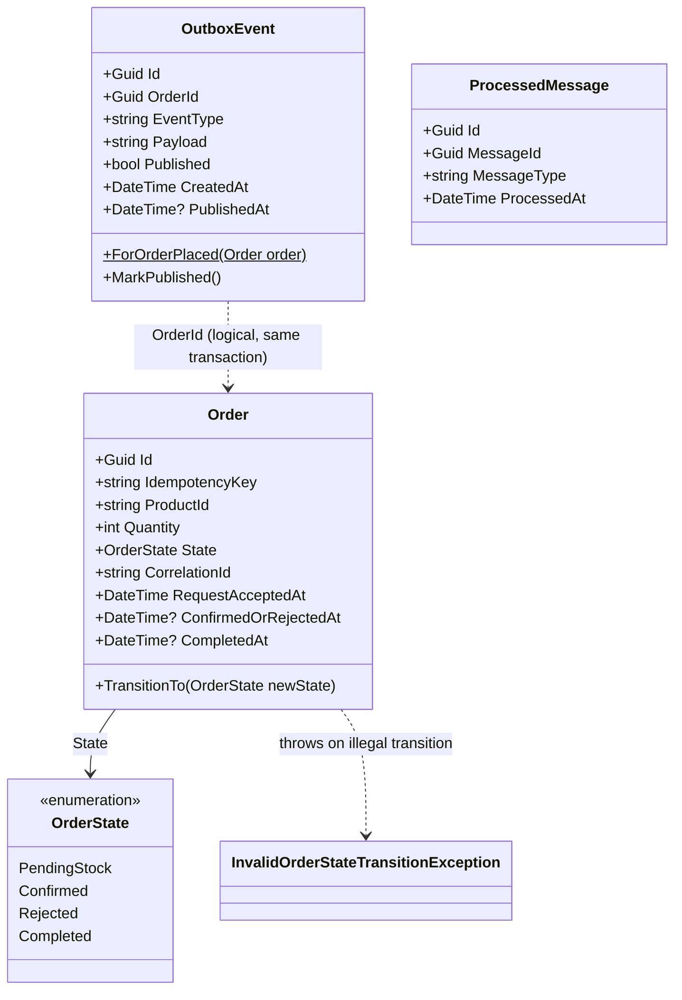
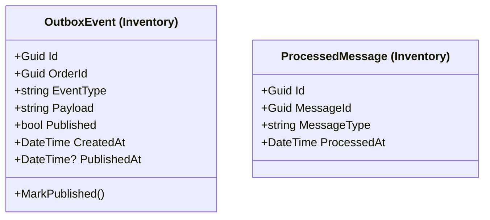
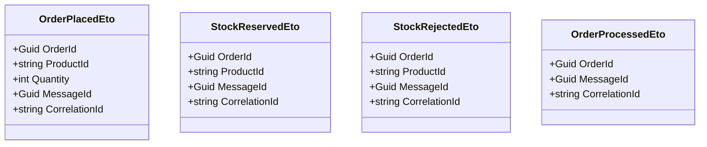

# Class Diagram

Domain entities and event contracts as they exist in code (checked by `scripts/verify-design-alignment.ps1`). Persistence mapping is in `docs/erd.md`, and event semantics are in `docs/event-contract.md`.

**Six-state model.** The adopted state model (`docs/order-state-machine.md`) adds `Processing` to `OrderState`, a new `OrderProcessingStartedEto` and an order status-history entity. None of these exist in code yet; they are the Week 11 task "Implement/verify the agreed Processing state/history". They are listed under "Planned" below, not drawn as if built.

## Order Service (`src/FlashSale.OrderService/Entities`)

## Inventory Service (`src/FlashSale.InventoryService/Entities`)

Separate classes from Order Service's classes with the same names; each service owns its own copy and its own schema.

## Event contracts (`src/FlashSale.EventContracts`)

| Event | Publisher | Consumer(s) |
|---|---|---|
| `OrderPlacedEto` | Order Service (Outbox) | Inventory Service |
| `StockReservedEto` | Inventory Service (Outbox) | Order Service, Process Worker |
| `StockRejectedEto` | Inventory Service (Outbox) | Order Service |
| `OrderProcessedEto` | Process Worker | Order Service |

## Planned (Week 11, not in code yet)

- `OrderState.Processing` and `OrderState.ProcessingFailed`. `ProcessingFailed` is declared but has no producer (success-only).
- `OrderProcessingStartedEto { Guid OrderId, Guid MessageId, string CorrelationId, DateTime StartedAt }`, published by the Process Worker.
- `OrderStatusHistory { Guid Id, Guid OrderId, OrderState? FromState, OrderState ToState, Guid? MessageId, DateTime At, bool Implied }`.
