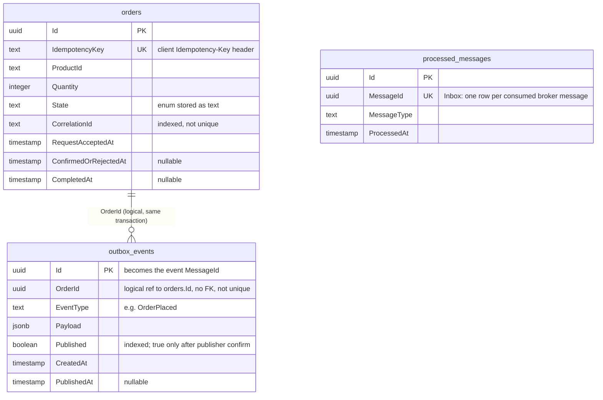
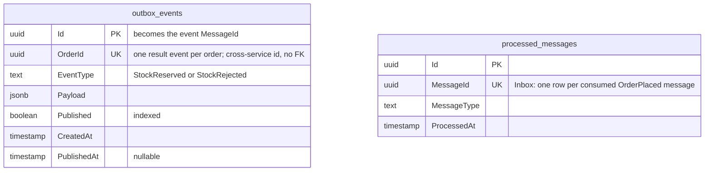
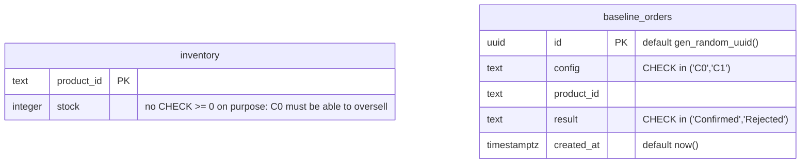

# Entity-Relationship Diagram (code-aligned)

**Status:** rewritten 2026-10-01 from the EF Core models, migrations and raw SQL in this repository, then checked against a live database built from scratch (see "How this ERD is verified"). It replaces the earlier hand-drawn draft. That draft had no Inventory Outbox, drew foreign keys that do not exist, and showed snake_case columns and `timestamptz` types that the migrations do not create.

**Sources of truth:**

- `src/FlashSale.OrderService/Data/OrderServiceDbContext.cs` and `src/FlashSale.OrderService/Migrations/`
- `src/FlashSale.InventoryService/Data/InventoryServiceDbContext.cs` and `src/FlashSale.InventoryService/Migrations/`
- `scripts/schema/baseline-schema.sql` (C0/C1 baseline tables)
- `infra/initdb/01-create-service-roles.sql` (roles, schema owners, grants)
- `scripts/redis/` (stock lives in Redis, not PostgreSQL)

## Architecture notes

- **One PostgreSQL instance, schema per service.** Order Service writes only `order_service` (plus ABP's tables in `public`). Inventory Service writes only `inventory_service`. Services exchange data only through RabbitMQ events, never through cross-schema reads or joins.
- **Separate accounts.** `order_service_user` owns `order_service` and is the only service account with access to `public`. `inventory_service_user` owns `inventory_service` and has no access to `order_service` or `public`. `flashsale` is the bootstrap/admin account only.
- **No foreign keys.** Every relationship below is *logical* (an id copied into another row), not a database constraint. The Outbox row and the order are linked by `OrderId`, and that is enforced by writing both in one transaction, not by an FK. Cross-service ids, such as Inventory's `OrderId`, cannot have an FK because the referenced table is in another service's schema.
- **Column names are PascalCase and quoted** (EF Core default, for example `"IdempotencyKey"`). Only the raw-SQL baseline tables use snake_case.
- **Timestamps** in EF-migrated tables are `timestamp without time zone` holding UTC values (`DateTime.UtcNow`). The baseline table uses `timestamptz`.
- **Stock is not in PostgreSQL** for the asynchronous design. Redis holds `inventory:{productId}` (available stock) and `processed:{productId}` (set of order ids already reserved). The Lua script checks and decrements both atomically.
- **Order states** follow `docs/order-state-machine.md`: six adopted states. The `State` column currently stores four of them (`PendingStock`, `Confirmed`, `Rejected`, `Completed`) until the Week 11 implementation task adds `Processing` and the status-history table. That table is **not** in this ERD because it does not exist in code yet.

## `order_service` schema (Order Service, EF Core)



`processed_messages` (the Inbox) has no relationship to `orders`. It records which broker messages (`StockReserved`, `StockRejected`, `OrderProcessed`) this service has already applied.

## `inventory_service` schema (Inventory Service, EF Core)



Inventory Service has both an **Outbox** (`outbox_events`, unique per `OrderId`, so retrying a reservation result never creates a second event) and an **Inbox** (`processed_messages`, unique per `MessageId`).

## Baseline tables (C0/C1 only, raw SQL)



These live in `order_service` but are created by `scripts/schema/baseline-schema.sql` (run by `scripts/reset-and-seed.ps1` as the `flashsale` admin account), not by EF Core. The script then hands ownership to `order_service_user`, because Order Service's C0/C1 code connects as that account. They exist only for the C0/C1 comparison and are unrelated to Redis stock.

## `public` schema: ABP module tables (owned by Order Service)

Order Service is an ABP application. Its first migration (`20260812083054_Initial`) creates 37 ABP module tables in `public` (`Abp*` for identity, permissions, settings, features, tenants and audit logs; `OpenIddict*` for the auth server). It also keeps its EF migration history in `public."__EFMigrationsHistory"`. ABP tables stay in `public` on purpose: `HasDefaultSchema("order_service")` breaks some ABP modules at runtime (see the comment in `OrderServiceDbContext`).

- Owner: `order_service_user`, the only service account with `USAGE, CREATE` on `public`.
- Inventory Service configures **no** ABP modules. Its `Initial` migration is empty, and its connection string sets `Search Path=inventory_service`, so its migration history goes to `inventory_service."__EFMigrationsHistory"`, not `public`.
- No experiment or business data lives in `public`.

## Unique constraints

| Constraint (index) | Guarantees |
|---|---|
| `order_service.orders."IdempotencyKey"` | One order per client Idempotency-Key (transport/client idempotency) |
| `order_service.processed_messages."MessageId"` | Order Service applies each broker message at most once (Inbox) |
| `inventory_service.processed_messages."MessageId"` | Inventory Service applies each `OrderPlaced` message at most once (Inbox) |
| `inventory_service.outbox_events."OrderId"` | At most one stock-result event per order |
| Primary keys on every table | Row identity; `outbox_events."Id"` doubles as the published MessageId |

Non-unique indexes: `orders."CorrelationId"` (trace lookup), `outbox_events."Published"` in both schemas (publisher polling).

## Verified schema manifest

`scripts/verify-erd.ps1` parses this table and compares it with a live database. Keep it in sync with the diagrams above. Column syntax: `name:type`, with a trailing `?` for nullable. Types: `uuid`, `text`, `integer`, `boolean`, `jsonb`, `timestamp` (without time zone), `timestamptz`.

| Table | Columns | Unique (non-PK) | Owner |
|---|---|---|---|
| order_service.orders | Id:uuid, IdempotencyKey:text, ProductId:text, Quantity:integer, State:text, RequestAcceptedAt:timestamp, ConfirmedOrRejectedAt:timestamp?, CompletedAt:timestamp?, CorrelationId:text | IdempotencyKey | order_service_user |
| order_service.outbox_events | Id:uuid, OrderId:uuid, EventType:text, Payload:jsonb, Published:boolean, CreatedAt:timestamp, PublishedAt:timestamp? | - | order_service_user |
| order_service.processed_messages | Id:uuid, MessageId:uuid, MessageType:text, ProcessedAt:timestamp | MessageId | order_service_user |
| order_service.inventory | product_id:text, stock:integer | - | order_service_user |
| order_service.baseline_orders | id:uuid, config:text, product_id:text, result:text, created_at:timestamptz | - | order_service_user |
| inventory_service.outbox_events | Id:uuid, OrderId:uuid, EventType:text, Payload:jsonb, Published:boolean, CreatedAt:timestamp, PublishedAt:timestamp? | OrderId | inventory_service_user |
| inventory_service.processed_messages | Id:uuid, MessageId:uuid, MessageType:text, ProcessedAt:timestamp | MessageId | inventory_service_user |

The script also checks that:

- the service schemas contain no tables beyond this list, except `inventory_service."__EFMigrationsHistory"`;
- there are no foreign keys in either service schema;
- `public` holds exactly 37 ABP/OpenIddict tables, all owned by `order_service_user`, plus Order Service's migration history;
- Inventory Service's migration history is in `inventory_service`, not `public`.

## How this ERD is verified

```powershell
# Against any database built by: initdb roles -> both services' migrations -> reset-and-seed
powershell -ExecutionPolicy Bypass -File .\scripts\verify-erd.ps1 -Container <postgres-container>
```

It prints one PASS/FAIL line per check and exits non-zero on any mismatch.

**Ownership history:** before 2026-10-01 the baseline tables kept the admin account (`flashsale`) as owner on a fresh database, so `order_service_user` had no privileges on them (`has_table_privilege` returned false) and C0/C1 would have failed. `baseline-schema.sql` now transfers ownership, so the fresh and existing-database paths give the same owner.
