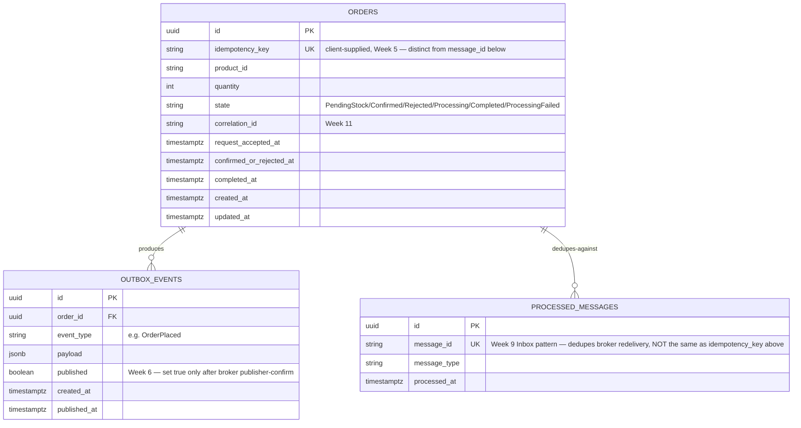
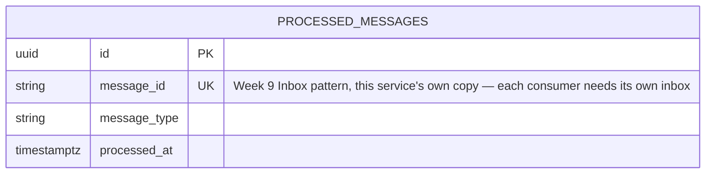
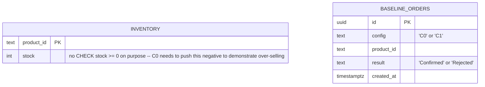

# Entity-Relationship Diagram — Schema-per-Service

Per `docs/00-scope-lock.md`'s boundary notes and the proposal's own §3 decision:
**schema-per-service, not database-per-service.** All tables below live in a single
PostgreSQL instance (`infra/docker-compose.yml`), each service owning its own schema
(`order_service.*`, `inventory_service.*`) so no service ever reads/writes another
service's tables directly — cross-service communication only happens through
RabbitMQ events, never a shared-schema join.

## `order_service` schema

## `inventory_service` schema

Inventory Service's actual stock counters live in **Redis**, not Postgres — see
`scripts/redis/reserve.lua` (Week 7). Redis keys:

- `inventory:{productId}` — integer, current available stock.
- `processed:{productId}` — set of `order_id`s already reserved for this product
  (this is the reservation-level idempotency check the Lua script does *before*
  touching Postgres at all — see `docs/inventory-invariants.md`, Invariant 3).

## Baseline-only tables (C0/C1, Week 3) — not part of the design above

`order_service.inventory` and `order_service.baseline_orders` (raw SQL,
`scripts/schema/baseline-schema.sql`) exist only for the C0/C1 baseline
comparisons and are **not** EF Core-migrated, **not** part of the async design
above, and have no relationship to Inventory Service's Redis-based stock at all.
C0 and C1 are both entirely inside Order Service — there's no separate
microservice call for either, since that only starts existing in Week 7.

Once the real design lands (Week 5+), `order_service.orders` and
`order_service.outbox_events` from the schema above become the actual EF
Core-migrated tables — `inventory` and `baseline_orders` stay as they are,
frozen evidence for the C0/C1 comparison in the report, not something later
weeks build on.

## Idempotency key naming — resolving the ambiguity flagged in Week 1

`docs/inventory-invariants.md`'s Invariant 3 query referenced a placeholder table
name (`inventory_reservation_log`) before this ERD existed. With the schema above
now fixed, that invariant is actually satisfiable two ways, both real:

1. **Redis, live:** `SISMEMBER processed:{productId} {order_id}` — the Lua script's
   own real-time check (Week 7).
2. **Postgres, post-hoc:** query `order_service.orders` grouped by `product_id`
   where `state IN ('Confirmed','Processing','Completed')`, since each `order_id`
   is already the table's primary key — a duplicate reservation for the same order
   would only be visible as a state anomaly, not a duplicate row.

Update `docs/inventory-invariants.md` Invariant 3's SQL block to reference
`order_service.orders` directly instead of the old placeholder name.

## Unique constraints enforcing idempotency (per Step 2.4's explicit reminder)

- `order_service.orders.idempotency_key` — `UNIQUE`, enforces client-facing
  idempotent order creation (Week 5).
- `order_service.processed_messages.message_id` — `UNIQUE`, enforces the
  Order Service's own broker-message idempotency (Week 9).
- `inventory_service.processed_messages.message_id` — `UNIQUE`, same pattern,
  Inventory Service's own inbox (Week 9).

These three constraints are the actual mechanism behind
`docs/inventory-invariants.md`'s Invariant 4 — decide these now (Week 2) so the
Week 9 migration is "add the constraint we already designed," not "figure out what
constraint we need."
