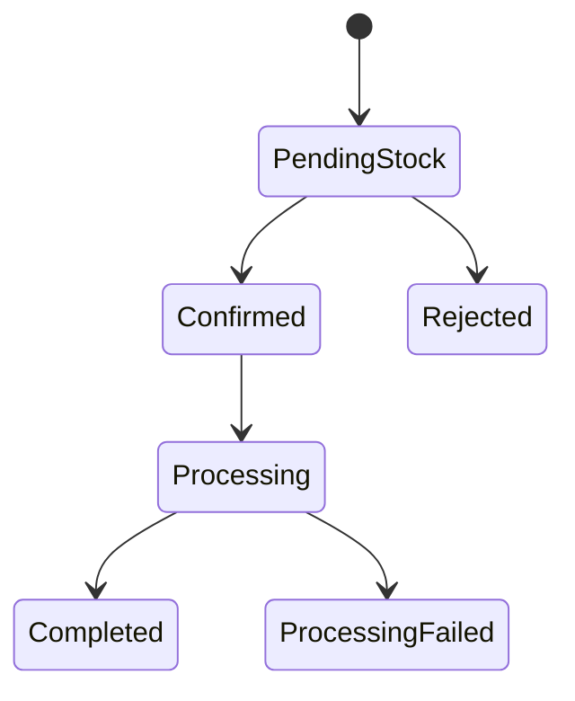

# Order State Machine — Week 1 Draft

**Status:** Partially specified — see "Open question" below. Per
`FLASHSALE_EXECUTION_CHECKLIST.md` Step 1.2: "Don't allow any transition you can't
currently name the trigger for." Two transitions can't be named precisely yet because
they depend on the Process Worker design, which isn't built until Week 11. That gap is
recorded here deliberately rather than papered over with an invented trigger.

## Diagram

## Transitions with a known, concrete trigger

| Transition | Trigger | Owning service | Built in |
|---|---|---|---|
| `[*] → PendingStock` | Client sends `POST /api/orders`; Order Service creates the order row (and, from Week 6 on, the paired `OrderPlaced` outbox row in the same transaction) and returns immediately without waiting for stock confirmation. | Order Service | Week 5 |
| `PendingStock → Confirmed` | Order Service consumes a `StockReserved` event, published by Inventory Service after its Redis Lua reservation script (Week 7) returns `RESERVED` for this order's product. | Order Service (consumer) | Week 8 |
| `PendingStock → Rejected` | Order Service consumes a `StockRejected` event, published by Inventory Service after the Lua script returns `REJECTED` (out of stock) for this order's product. | Order Service (consumer) | Week 8 |

## Open question — not yet resolvable

| Transition | Status |
|---|---|
| `Confirmed → Processing` | **Trigger not yet named.** The Process Worker (Week 11) "consumes `StockReserved` … publishes a completion result" per the checklist — i.e. it appears to react to the *same* event that drives `PendingStock → Confirmed`, not to a distinct `Confirmed`-state signal. Until the Process Worker's exact input event and its relationship to Order Service's own state transition are pinned down in Week 11, this transition's trigger is a placeholder, not a decision. |
| `Processing → Completed` / `Processing → ProcessingFailed` | **Trigger not yet named**, same root cause: depends on what event the Process Worker publishes on completion, and how Order Service's consumer for that event is wired. Given the current scope lock (`docs/00-scope-lock.md`), only the success path (`Completed`) is expected to occur in practice — `ProcessingFailed` exists as a state but no deliberate failure-injection mechanism is in scope, so this branch may end up unreachable in practice unless Week 11 adds one. |

**Action for Week 4 / Week 11:** when the event contract (`docs/event-contract.md`,
Week 4) and the Process Worker (Week 11) are actually designed, resolve this table
into concrete rows in the section above, and update this document — don't let the
diagram silently outlive its own accuracy.

## Per-transition report note

Each row above becomes one entry in the event contract (`docs/event-contract.md`,
Week 4) — event name, payload shape, and idempotency key. Building the contract table
directly from this state machine (rather than separately) is what keeps the two from
drifting apart.
