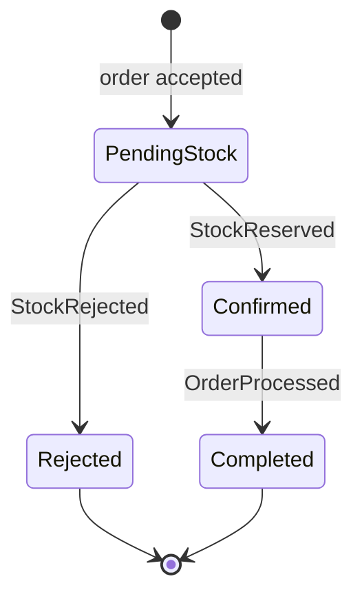

# Order State Machine

| Transition | Trigger | Owner |
|---|---|---|
| New → `PendingStock` | Order and `OrderPlaced` Outbox row commit; API returns accepted order ID | Order Service |
| `PendingStock` → `Confirmed` | Inventory publishes `StockReserved` after a successful reservation | Order Service |
| `PendingStock` → `Rejected` | Inventory publishes `StockRejected` when stock is unavailable | Order Service |
| `Confirmed` → `Completed` | Process Worker publishes `OrderProcessed` after its deterministic delay | Order Service |

`Rejected` and `Completed` are terminal. Illegal transitions must fail. `Processing` and `ProcessingFailed` are excluded: the current workflow has no processing-start event or failure outcome. Add either state only with a real event and requirement that can reach it.

An accepted order that remains `PendingStock` is a liveness failure to investigate, not a terminal success. Retry, dead-letter, and reconciliation behavior is covered by the later week gates.
