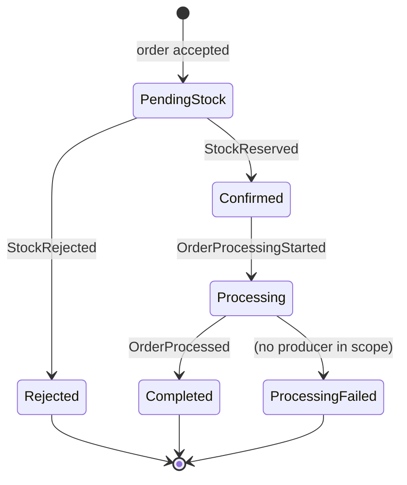

# Order State Machine

**Adopted interpretation (decided 2026-10-01 by the project owners):** the order uses the teacher's **six named states**: `PendingStock`, `Confirmed`, `Rejected`, `Processing`, `Completed`, `ProcessingFailed`. This replaces the four-state model (`PendingStock`, `Confirmed`, `Rejected`, `Completed`) that the source code adopted in Week 11.

| Transition | Trigger | Producer | Applied by |
|---|---|---|---|
| New → `PendingStock` | Order and `OrderPlaced` Outbox row commit; API returns the accepted order ID | Order Service | Order Service |
| `PendingStock` → `Confirmed` | `StockReserved` after a successful Redis reservation | Inventory Service | Order Service |
| `PendingStock` → `Rejected` | `StockRejected` when stock is unavailable | Inventory Service | Order Service |
| `Confirmed` → `Processing` | `OrderProcessingStarted`, published when the Process Worker begins work on a reserved order | Process Worker | Order Service |
| `Processing` → `Completed` | `OrderProcessed`, published after the Worker's deterministic delay | Process Worker | Order Service |
| `Processing` → `ProcessingFailed` | None in scope (see below) | — | — |

`Rejected`, `Completed` and `ProcessingFailed` are terminal. Any transition not in the table must fail with `InvalidOrderStateTransitionException`.

## Interpretation of each teacher state

- **`Processing`** is a real, reachable state. It means "the Process Worker has started downstream work and has not finished". Its trigger is a new `OrderProcessingStarted` event, so Order Service observes it instead of guessing.
- **`ProcessingFailed`** is declared but **unreachable by design (success-only interpretation).** The scope lock (`docs/00-scope-lock.md`) gives the Process Worker a deterministic delay and a successful outcome only, and excludes payment failure and compensation. So no event in scope produces it. It stays in the enum and the diagram so the model matches the teacher's six states. A test must prove that no handler reaches it. It becomes reachable only if a failing Worker outcome is added to scope with its own event.

## Delivery rules (reordering and duplicates)

Events can arrive late, twice or out of order. Order Service applies them like this:

- **Same or earlier state:** an event whose target state is the current state or an earlier one in `PendingStock → Confirmed → Processing → Completed` is acknowledged as a no-op. Example: a late `OrderProcessingStarted` arriving after `Completed`.
- **`OrderProcessed` while `Confirmed`:** the started event has not arrived yet. Order Service applies `Confirmed → Processing → Completed` in one transaction. The `Processing` history row is marked as implied and takes the Worker's start time, carried on `OrderProcessed`.
- **Worker event while `PendingStock`:** the `StockReserved` result has not been applied yet. The message is nacked for bounded retry and is not dropped.

A throwaway prototype checked these rules on 2026-10-01. It replayed every 5-event sequence that contained all three of `StockReserved`, `OrderProcessingStarted` and `OrderProcessed`, with duplicates and reordering allowed: 150 sequences. All of them ended `Completed`, with the history `PendingStock → Confirmed → Processing → Completed`. The prototype was deleted after the check.

## State history

Every transition appends a row to an order status history: order ID, from-state, to-state, the triggering MessageId, the time, and whether it was implied. The history is written in the same transaction as the state change. The current `orders` timestamp columns stay as they are.

## Source alignment status

| Item | Status |
|---|---|
| This document (adopted model) | Done, 2026-10-01 (Week 1) |
| `OrderState` enum, transitions, `OrderProcessingStarted` event, Worker publish, history table, tests | **Open:** Week 11 box "Implement/verify the agreed Processing state/history and document the success-only interpretation of ProcessingFailed" |
| ERD, event contract, sequence diagrams | **Open:** Week 2/Week 4 alignment boxes |

Until the Week 11 box closes, the running code still has four states. Do not report six-state behaviour as implemented until then.

An accepted order that stays in `PendingStock` or `Processing` is a liveness failure to investigate, not a success. Retry, dead-letter and reconciliation are covered by the later week gates.
