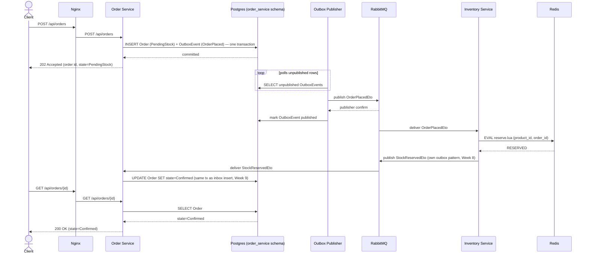
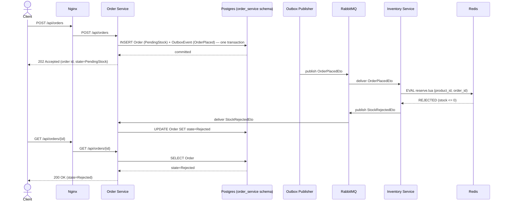

# Sequence Diagrams

Two diagrams for the one workflow the system has (place an order), split by
outcome. Both represent the **target design** (Weeks 5–9) — Outbox, the
publisher worker, RabbitMQ, and Inventory Service don't exist yet as of
Week 4; this is the design these weeks build toward, not a description of
what currently runs. `docs/order-state-machine.md` is the source of truth
for which transition each arrow corresponds to; `docs/event-contract.md` is
the source of truth for each event's exact shape.

## Happy path — stock available

## Rejection path — out of stock

Identical up through the Redis call; diverges only at the reservation
result. Everything about *how* the request travels is the same — only the
event type and the terminal state differ.

## What's deliberately not shown

Neither diagram extends into `Confirmed → Processing → Completed`. Per
`docs/order-state-machine.md`, that leg's trigger isn't resolvable yet — it
depends on the Week 11 Process Worker design. Drawing it here would mean
inventing a mechanism, which is exactly what that document says not to do.
Redraw both diagrams once Week 11 answers that question, rather than
guessing now and quietly leaving a wrong diagram in the report.
