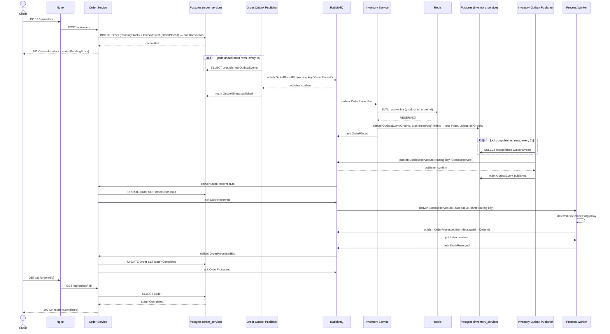
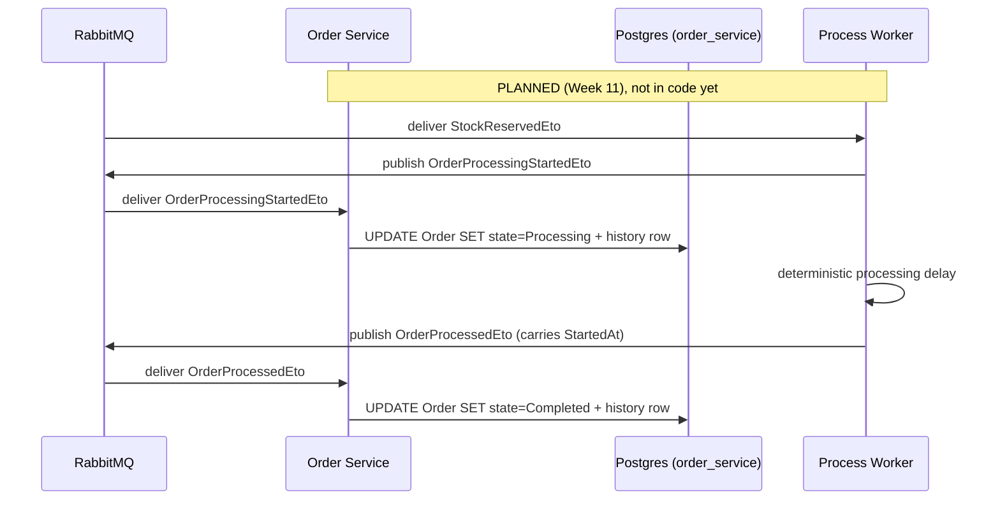
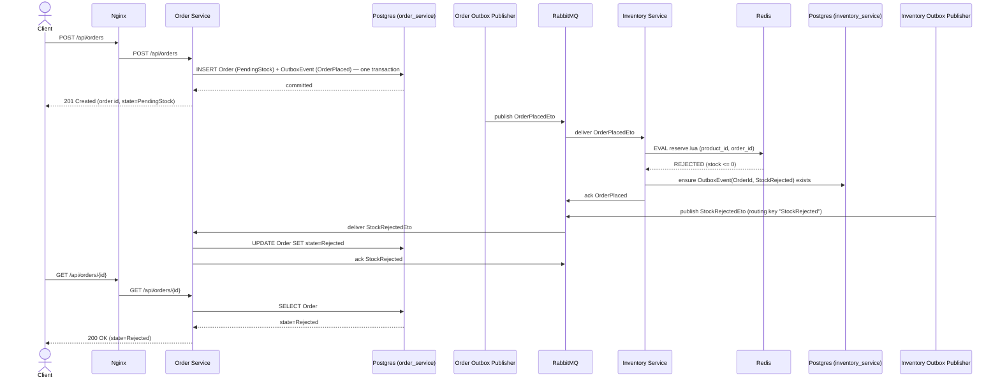

# Sequence Diagrams

Two diagrams for the one workflow the system has (place an order), split by
outcome, plus one clearly labelled planned hop for the six-state model. Both reflect what was **actually built and verified live** — through
Week 8 for the Outbox/RabbitMQ/Redis path, and extended in Week 11 with the
Process Worker leg that carries the happy path all the way to `Completed`.
The Week 4 version of this file was the target design, drafted before any of
it existed; it has been corrected against the real implementation twice since
(Step 8.4, then Week 11) rather than left to drift.
`docs/order-state-machine.md` is the source of truth for which transition
each arrow corresponds to; `docs/event-contract.md` is the source of truth
for each event's exact shape.

**Corrections from the Week 4 version**, so the diff is explicit rather than
silent:

- `POST /api/orders` returns **`201 Created`**, not `202 Accepted` as
  originally drawn — matches the actual `OrdersController.CreateOrderAsync`.
- Inventory Service's result publication was drawn as a single direct
  `publish StockReservedEto` arrow. It is actually the same two-phase Outbox
  pattern as Order Service's own (Week 6): Inventory Service writes an
  outbox row to **its own** Postgres schema (`inventory_service`), and a
  separate background worker polls and publishes it — not an inline publish
  from the message handler. The diagrams below show both hops on both
  sides, symmetrically.
- Nginx is drawn as it will work once Week 12 adds real routing, but all
  verification through Week 8 hits each service directly on its own port —
  Nginx is still the Week 2 placeholder stub. Treat the Nginx hop below as
  target design, not yet-exercised behavior.

## Happy path — stock available

Verified live end-to-end: through Week 8 as far as `Confirmed`, and in
Week 11 all the way to `Completed` — a real order posted through this exact
path took roughly 2.5 seconds from accepted to completed, with every hop
observed directly (Postgres rows, RabbitMQ queue depths, Redis keys, and all
three services' logs correlated by a single correlation id), not inferred.

**Note the fork after `StockReserved`.** RabbitMQ delivers that one event to
*two* queues — Order Service's and the Process Worker's — because both are
bound to the same direct exchange with the same routing key. The two
consumers then act independently and concurrently: Order Service records
`Confirmed` while the Process Worker starts its delay. In the current code, Order Service is told only that
processing has *finished*, so the order goes straight from `Confirmed` to
`Completed`. The adopted six-state model (`docs/order-state-machine.md`,
2026-10-01) adds one hop that is **not built yet**. It is the Week 11 task
"Implement/verify the agreed Processing state/history":

If `OrderProcessedEto` arrives before the started event, Order Service applies
`Confirmed → Processing → Completed` in one transaction, with the `Processing`
history row marked as implied. `ProcessingFailed` has no producer
(success-only Process Worker).

## Rejection path — out of stock

Identical up through the Redis call; diverges only at the reservation
result. Everything about *how* the request travels is the same — only the
event type and the terminal state differ.

Verified live the same way as the happy path: a product forced to zero
stock, ordered through the real API, observed transitioning to `Rejected`
end to end.

## The DUPLICATE case (not its own diagram, but worth stating precisely)

`reserve.lua` can also return `DUPLICATE` (a redelivered `OrderPlaced` for
an order already reserved). This does not get its own diagram because it
does not diverge in the messages exchanged — only in what Inventory Service
does internally: `DUPLICATE` still runs the "ensure OutboxEvent exists"
step above (treated as `StockReserved`), rather than being a no-op. See
`Entities/OutboxEvent.cs` (Inventory Service) for why: skipping it on
`DUPLICATE` would mean a redelivered message that already reserved stock in
Redis could still leave Order Service's copy of the order stuck in
`PendingStock` forever, since nothing would ever tell it the reservation
succeeded.

## What's deliberately not shown

**State model (updated 2026-10-01).** The happy path above runs to
`Completed`, which is the code as built. The teacher's `Processing` state is
drawn only as the planned hop under "Note the fork" above, until Week 11 builds
it. `ProcessingFailed` is never drawn because nothing in scope produces it.

Still not drawn, on purpose:

- **The Inbox check on each consumer** (Week 9). Every `deliver`/`ack` pair
  above elides a "has this MessageId been seen?" lookup and the
  same-transaction Inbox insert that accompanies the state change. Drawing
  them would double the arrow count to restate one rule that applies
  uniformly at every consumer, and the place to read that rule precisely is
  `StockResultProcessor`, not a diagram.
- **Retry and dead-lettering** (Week 10). Every `ack` above is the success
  branch; the bounded retry ladder and the DLQ hop on exhaustion are omitted
  for the same reason.
- **The Nginx hop as reality.** It is drawn as it will work once Week 12 adds
  real routing; all verification so far hits each service directly on its own
  port, since Nginx is still the Week 2 placeholder stub.
