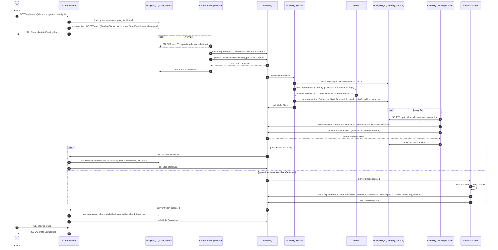
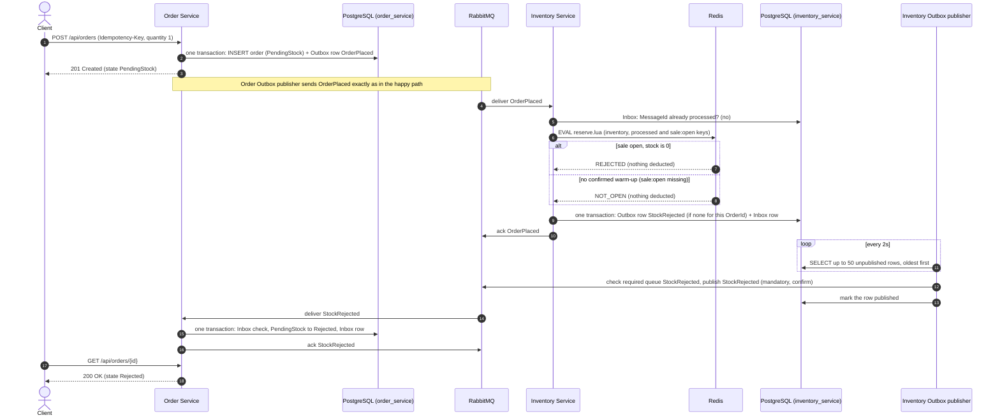
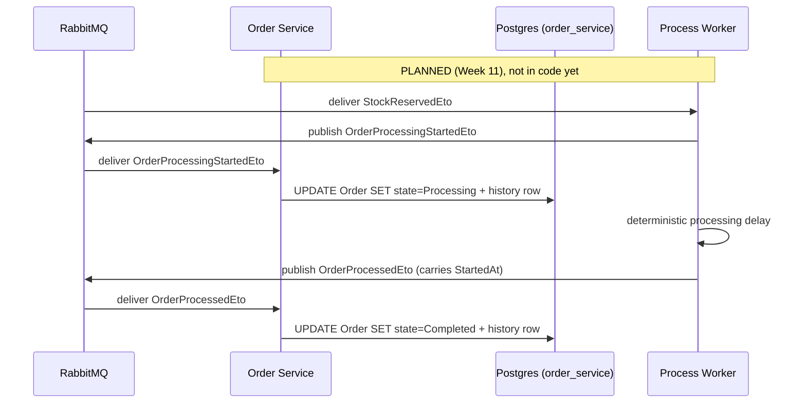

# Sequence Diagrams

These are the diagrams for the one workflow the system has: placing an order.
They are drawn from the code as it is on branch `week1-2` (Week 8). Every
arrow is a call that exists in the source. The step numbers match the
numbered steps in `docs/workflow.md`, which names the class behind each step,
its failure branch and its test case.

`scripts/verify-workflow.ps1` checks the diagrams in two ways:

- It compares each claim with the code and configuration.
- It traces real orders through all three services and checks that the
  recorded hops happen in this order.

The `.mmd` files in `report/figures/` must be identical to the blocks below.
The report's PNGs are rendered from them with mermaid-cli 11 and
`report/figures/mermaid-sequence.json`, which wraps long labels so the text
stays readable at page width.

**Changes from the earlier version (2026-10-02, Week 8 box 4):**

- **Nginx removed.** Clients call Order Service directly. `infra/nginx.conf`
  is still the Week 2 placeholder: it answers every request itself and
  forwards nothing. Nginx routing and rate limits arrive in Week 12.
- **Publishers now show routed confirmation (Week 6).** Before publishing,
  each publisher checks that every required subscriber queue exists and is
  bound. It then publishes with `mandatory` and waits for the confirm.
  `StockReserved` needs both `StockReserved` and `ProcessWorker.StockReserved`.
- **Inbox steps are drawn.** In both services the Inbox check comes before
  the business step. The Inbox row commits in the same transaction as the
  Outbox row (Inventory) or the state change (Order Service).
- **The warm-up gate (Week 7) is drawn.** `reserve.lua` reads `sale:open`,
  and `NOT_OPEN` becomes `StockRejected` with nothing deducted.
- **The fork after `StockReserved` is drawn as `par`.** The two consumers run
  concurrently.

## Happy path: stock available

The Process Worker has no Inbox. A redelivered `StockReserved` makes it
publish `OrderProcessed` again with the same `MessageId` (the `OrderId`), and
Order Service's Inbox absorbs that copy.

**Race in the `par` block (handled since Week 9).** The two branches are
independent. If `OrderProcessed` (step 28) reaches Order Service before step
22 has committed, the order is still `PendingStock`. Order Service then writes
nothing for it and republishes it onto a delayed retry queue
(`OrderProcessed.retry.1`–`.3`, 2 s / 4 s / 8 s). It is applied once the order
is `Confirmed`, and dead-lettered only if it is still early after three
requeues (`docs/design-decisions.md` §2, TP-M02).

## Rejection path: sold out, or sale not open

The Process Worker does not subscribe to `StockRejected`, so a rejected order
never reaches it.

`DUPLICATE` (a redelivered `OrderPlaced` whose order already holds a unit)
does not need its own diagram. It follows the happy path from step 14 and
maps to `StockReserved` without deducting again. Because the Outbox row is
"ensure it exists for this OrderId", a redelivery cannot leave the order
waiting with no result.

## Planned hop: Processing (Week 11)

The adopted six-state model (`docs/order-state-machine.md`) adds one hop that
is not built yet:

If `OrderProcessedEto` arrives before the started event, Order Service applies
`Confirmed → Processing → Completed` in one transaction, with the `Processing`
history row marked as implied. `ProcessingFailed` has no producer
(success-only Process Worker).

## Not drawn as arrows

- **Retry and DLQ branches.** Every consumer and publisher has a failure
  branch. `docs/workflow.md` lists each one with its test case, rather than
  doubling the arrows here.
- **Reconciliation.** `ReconciliationWorker` checks every 30 s for orders
  stuck in `PendingStock` for more than 30 s and writes a new `OrderPlaced`
  Outbox row for them. This is a safety net and is verified in Week 10.
