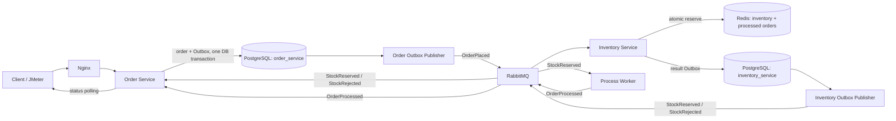

# Service Boundaries

## Ownership

| Component | Owns | Communicates through |
|---|---|---|
| Order Service | Order state, client idempotency key, Order Service Outbox and processed-message records | HTTP API; RabbitMQ events |
| Inventory Service | Reservation decision; its Outbox and processed-message records | `OrderPlaced` event, Redis Lua, RabbitMQ result events |
| Process Worker | Deterministic simulated downstream work; no business database | `StockReserved` in, `OrderProcessed` out |
| PostgreSQL | One physical instance; `order_service` and `inventory_service` schemas | Service-specific database credentials; no cross-schema reads |
| Redis | Available stock and reservation-level order deduplication | Atomic Lua script called by Inventory Service |
| RabbitMQ | Event exchange, service queues, retry/dead-letter routing | Durable messages and publisher confirms |
| Nginx | HTTP entry point and rate limiting when C3 is implemented | Proxies client requests to Order Service |
| JMeter | Load generation and result collection | Runs on a machine separate from the EC2 system under test |

## Order workflow

The two PostgreSQL schemas share an instance; they are not physical database isolation. The teacher brief requires distinct service accounts and prohibits cross-service schema access. Record any mismatch in the Week 2 infrastructure review before treating that requirement as met.

`StockReserved` is delivered independently to Order Service and Process Worker. Order Service records the reservation result; Process Worker later emits completion. Under the adopted six-state model (`docs/order-state-machine.md`, 2026-10-01), the Process Worker will also publish `OrderProcessingStarted` so that Order Service can enter `Processing`. That event is not built yet; it is the Week 11 implementation task.

Table-level data ownership, constraints and the `public` schema used by ABP are documented in `docs/erd.md`, and `scripts/verify-erd.ps1` checks them against a live database.
